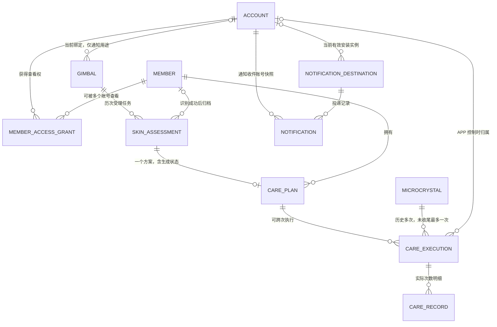

# 数据架构设计 V1：五模块领域模型与 MVP 库表

日期：2026-09-10

状态：设计初稿，供评审；尚未创建数据库或实施迁移。

范围：现有五模块、27 个对外 HTTP API、云台与 APP 双控制场景，以及 OSS 图片存储。

## 1. 设计结论

建议使用 **一个 PostgreSQL 业务库，11 张业务表 + 3 张公共支撑表，共 14 张表**。模块是代码与数据职责边界，不拆成五个数据库。Java Web 后端与 Python 异步 Worker 共用这个数据库，通过 PG 工作项交接；图片二进制保存在私有 OSS，数据库保存对象引用、业务归属和状态。

**查询原则：业务 SQL 默认不写 JOIN。** 优先单表读取，必要时采用有上限的分步查询和应用层组装；列表补充信息使用批量查询，禁止逐行补查造成 N+1。保留外键、唯一约束和事务，它们与是否编写 JOIN 查询是两回事。复杂写入会涉及多表校验，不强行承诺一次请求只访问一张表。详见第 12.1—12.4 节。

MVP 优先用宽表：

- 测肤任务、照片版本清单、身份处理结果、统一报告放在一张表中，不另建报告主表、指标表、左右脸结果表。
- 护理方案、步骤、参数、目标 N 和累计进度 K 放在一张表中，不拆方案步骤、参数字典和进度表。
- 云台的当前账号绑定、最后心跳和异常摘要放在云台表，不拆绑定关系表、心跳流水表。
- 一次护理的控制端、核验摘要、最新状态、收尾信息放在执行表，不按每类状态另建表。
- **实际次数明细、成员访问关系、推送安装实例、公共异步任务和请求去重单独存储**：它们需要独立的唯一约束或生命周期，硬塞进 JSON 数组会增加并发与重试问题。

“宽表”不等于所有内容都是 JSON。参与关联、权限、去重、排序和状态判断的字段使用普通列；报告指标、方案步骤、外部算法结果等变化较多的从属内容使用 JSONB。JSONB 也有结构版本和服务端校验，不接收任意字段直接入库。

本设计依据同目录的 [API 设计](后端API接口设计-V1-五模块与流程对应.md)、[测试决策记录](测试需求决策记录.md)、[测试场景清单](测试场景清单-V1-五模块与双控制.md) 和 [运行组件说明](运行组件说明.md)。已确认业务规则沿用这些文档；本文的表名、字段名、状态编码、锁与去重方案是实现建议，不代表已经落地。

## 2. 领域模型：先明确业务对象

### 2.1 五模块划分

| 模块 | 领域对象 | 对象的业务含义 | 模块负责的规则 |
|---|---|---|---|
| M1 成员身份与访问授权 | 账号、成员、账号与成员的访问关系 | 成员代表被识别的人；账号代表登录 APP 的主体；访问关系连接二者 | 可靠身份归档、永久查看授权、主动撤销、查询时重新检查权限 |
| M2 云台与微晶管理 | 云台、微晶、云台账号绑定 | 云台采集和追踪；微晶执行护理；云台绑定确定异常通知对象 | 独立云台认证、配网后的主动绑定、原账号解绑、最新设备状态 |
| M3 测肤任务与报告 | 测肤任务、照片版本、统一测肤报告 | 一次被受理的测肤工作及其产出；补拍是同任务的新照片版本 | 云台唯一当前任务、照片版本隔离、报告归档、两端结果投影 |
| M4 护理管理 | 护理方案、护理执行、实际完成记录 | 方案决定 N；执行代表一次控制过程；记录是累计 K 的依据 | 身份核验、微晶独占、固定记录归属、补传去重、收尾、K ≥ N 完成 |
| M5 消息通知 | APP 安装实例的推送目标、异常通知 | 推送目标代表某次 APP 安装；通知代表一次异常向某个目标的投递 | 当前绑定账号路由、退出与换号失效、抑制重复、失败重试 |

领域对象不必与表一一对应。例如“照片版本”和“报告”是 M3 的领域对象，但 MVP 合并到测肤任务宽表；“微晶占用”属于 M4 的执行规则，通过执行表约束实现，不增加占用表。

### 2.2 四个不能混用的身份

| 标识 | 代表什么 | 不代表什么 |
|---|---|---|
| `account_id` | 登录 APP 的账号 | 不等于成员，不因绑定云台而获得成员资料 |
| `member_id` | 一个被识别的人及其测肤、护理档案 | 不等于账号，不随账号撤销查看关联被删除 |
| `gimbal_id` | 一台独立认证的云台 | 不等于其绑定账号，不是成员历史查询凭证 |
| `microcrystal_id` | 一台实际执行护理的微晶 | 不代表当前控制端；连接观察也不等于取得占用 |

`installation_id` 另外代表一次 APP 安装，用于推送和 APP 控制实例识别；它不是手机硬件唯一识别码，也不能单独作为认证凭据。APP 重装产生新安装实例，不自动继承旧执行控制身份。

本版新增本地 `accounts` 账号表，由 M1 管理基础账号档案，`account_id` 统一引用其主键，不再假定已有外部账号表。外部登录主体先映射为本地账号 ID，业务表不直接保存供应商账号作为关联键。账号注册、登录、退出等 HTTP 契约尚不在现有 27 个业务 API 中，新增表不代表这些接口已经定义；已确定手机号登录，后续补齐手机号验证和会话接口设计，不增加第六个模块。

### 2.3 主要关系



`ACCOUNT` 对应本库的 `accounts` 表，计入这 14 张表。图表示历史关联，不代表访问权。云台虽然产生多条历史任务，**只可访问 `current_assessment_id` 指向的任务**。该指针不放进绑定关系，不随登录账号变化。公共图片、请求去重和任务队列未展开在此业务关系图中。

## 3. 库表总览与合并取舍

| 编号 | 归属 | 表名 | 一行代表什么 | 合并到这一行的内容 |
|---|---|---|---|---|
| T14 | M1 基础账号 | `accounts` | 一个 APP 登录账号 | 登录主体映射、账号状态、基本资料、认证代次 |
| T01 | M1 | `members` | 一个人的档案 | 身份索引引用、基本资料、建档来源 |
| T02 | M1 | `member_access_grants` | 一次账号—成员授权关系 | 授权核验摘要、撤销状态；重新授权另起一行 |
| T03 | M2 | `gimbals` | 一台云台 | 当前绑定、绑定代次、心跳、异常摘要、当前任务指针 |
| T04 | M2 | `microcrystals` | 一台微晶 | 单一类型、能力、最后一次有效连接与状态观察 |
| T05 | M3 | `skin_assessments` | 一次测肤任务及统一报告 | 照片版本清单、处理状态、报告指标与图片引用 |
| T06 | M4 | `care_plans` | 一个任务的护理方案 | 生成状态、方案步骤与参数、N、K、完成时间 |
| T07 | M4 | `care_executions` | 一次护理执行 | 控制端、核验摘要、最后状态、同步与收尾信息 |
| T08 | M4 | `care_records` | 一条已接收的实际完成记录 | 稳定去重标识、归属、实际次数、原始载荷摘要 |
| T09 | M5 | `notification_destinations` | 一个 APP 安装实例的当前推送目标 | 账号归属、通道注册信息、会话关联、有效性 |
| T10 | M5 | `notifications` | 一次异常向一个安装实例的通知 | 路由快照、消息内容、投递状态、重试摘要 |
| T11 | 公共 | `media_objects` | 一个 OSS 图片对象 | 上传来源、业务归属、版本、完整性和存储状态 |
| T12 | 公共 | `async_jobs` | 一个可重试后台工作项 | 输入版本、排队、租约、尝试次数、错误摘要 |
| T13 | 公共 | `idempotency_requests` | 一个主体的一次逻辑写请求 | 请求摘要、处理状态、资源引用、最小响应摘要 |

表编号保留原 T01—T13，新增账号表编号 T14；编号仅用于文档引用，不代表建表顺序。

本版不建：独立报告表、报告指标表、方案步骤表、方案版本表、独立进度表、云台绑定流水表、每次心跳表、微晶占用表、单独 outbox 表、文件夹表、消息模板表、厂商型号字典表。后台工作项同时承担可靠待办职责，不再叠加消息队列表。

不把次数明细合进执行 JSON：明细是追加数据，需要稳定唯一键、逐条确认和重建 K。也不把多个推送目标合进账号 JSON：每个安装实例会独立换号、失效和重试。

## 4. 通用字段与存储约定

- 业务主键建议使用服务端生成的 `uuid`；客户端请求去重键和记录 ID 使用 `text`，限制长度并校验格式。本地账号主键及所有明确的账号外键统一用 `uuid`；外部登录主体标识用 `text`，仅保存在账号表映射字段中。
- 时间统一使用 `timestamptz`；区分客户端 `occurred_at` 和服务端 `received_at`，不把客户端时钟当作全局顺序依据。
- 普通状态字段用 `text + CHECK`；字段的示例状态是本版建议，详细接口应与之统一。跨字段/跨表条件由事务保证，不能仅写注释。
- 计数字段用 `bigint`，`N > 0`、`K >= 0`、`count_delta > 0`；接口显式处理大整数编码，不依赖浏览器浮点数隐式精度。
- 默认主键、归属、状态字段必填；允许为空的阶段性字段在下文说明。所有表有 `created_at`，可变表另有 `updated_at`。流水表不通过更新改变已确认的业务载荷。
- 高频过滤字段使用普通列并按实际查询建 B-tree 索引。MVP 不给所有 JSONB 默认建 GIN 索引；需要按其中某个字段检索时再评估提列或建针对性索引。
- 所有 JSONB 有 `schema_version`，结构由服务端校验。结构版本用于数据格式演进，不等于产品的“多个方案版本”。PostgreSQL 支持 JSONB 检索，但仍应控制单个文档大小和更新争用，见[官方 JSON 类型说明](https://www.postgresql.org/docs/16/datatype-json.html)。
- 领域内部采用数据库外键；跨模块同库也保留必要外键。`member_id`、任务与方案的重复归属用组合唯一键及组合外键校验，或在持锁事务中严格校验，迁移设计时明确实现；不能允许报告属甲而方案属乙。
- 引用业务数据默认禁止级联物理删除。撤销授权、解绑、替换当前任务均不删除历史档案。图片清理必须确认无有效引用，不给业务主表统一套用含义不清的软删除规则。

## 5. M1：账号、成员身份与访问授权

### T14 `accounts`：账号宽表

一行代表一个登录 APP 的账号，独立于被识别的人脸成员。先保存 MVP 必需的账号信息，不拆账号资料表、登录方式表；一个账号本版对应一种已验证的登录身份。未来需要同一账号绑定多种登录方式时，再增加身份关联表，不能把多个登录凭据随意塞进 JSON 而失去唯一约束。

| 字段 | 类型 | 含义与约束 |
|---|---|---|
| `id` | uuid PK | 后端生成的稳定账号 ID；业务中的 account_id 均引用此值 |
| `login_provider`, `login_subject` | text，必填 | 登录身份命名空间与已验证的稳定主体 ID，组合唯一；不是用户随意填写的昵称，也不是临时 token |
| `status` | text，默认 active | `active` / `disabled`；停用账号不能凭旧登录凭据继续访问业务 |
| `auth_revision` | bigint，默认 1 | 账号级认证代次；停用或需要全账号凭据失效时递增，旧代次凭据失效 |
| `profile` | jsonb，默认空对象 | 已明确需要的昵称、头像引用等基本展示资料；不复制成员人脸身份、报告或授权关系 |
| `last_login_at` | timestamptz，可空 | 最近一次成功登录时间，普通业务调用不更新此值 |
| `disabled_at` | timestamptz，可空 | 停用时间，和 status 一致 |
| `created_at`, `updated_at` | timestamptz | 创建与最后修改时间，沿用通用字段规则 |

`login_provider` 应包含足以区分主体的命名空间，例如供应商和应用/租户范围，避免不同应用下同名 subject 被认成一个账号；MVP 采用手机号登录，身份命名空间和经验证手机号的规范化映射在认证契约中定义。必须在登录身份验证成功后建立或定位账号，用组合唯一约束防止并发首次登录重复建号。本版只接入手机号登录，不扩展微信/密码登录及多身份合并；不存明文密码、验证码或会话 token 到 profile。

核心索引：主键 `id`、`UNIQUE(login_provider, login_subject)`。账号 profile 不按 JSON 全字段建立索引。账号注销及身份重新注册策略尚未定义，MVP 不自动物理删除账号、不自动合并同名账号；停用不级联删除成员、授权历史、报告、执行或通知记录。

账号级 auth_revision 不替代每个安装实例/会话的退出协议。退出某个 APP 实例时，仍须使该实例会话与 T09 推送目标失效；不因为单个实例退出而默认使全部设备退出。

明确账号外键统一如下，默认限制删除，避免删除账号破坏历史归属：

| 引用表/字段 | 关联与可空性 |
|---|---|
| T02 `account_id` | uuid FK → accounts.id，必填 |
| T03 `bound_account_id` | uuid FK → accounts.id，可空，解绑清空 |
| T07 `controller_account_id` | uuid FK → accounts.id；APP 执行必填，云台执行为空 |
| T09 `account_id` | uuid FK → accounts.id；active 时必填，目标解除归属后可空 |
| T10 `account_id` | uuid FK → accounts.id，保留创建通知时收件账号 |

T13 的 principal_id 等通用主体引用仍按主体类型存储规范化文本；APP 主体中的账号部分使用本地 accounts.id，不再使用外部登录 subject。它们不是可直接声明统一账号外键的多态字段，由服务端验证归属。

**不增加 JOIN：**认证层先按本地账号 ID 单表读取 T14，检查 status/auth_revision，再把 account_id 放入本请求上下文；后续各模块直接使用该 ID，通常无需重复查询账号表。本文第 12 节统计的是业务 SELECT，这一次统一账号认证查询另计，不能把它忽略后宣称整个 HTTP 请求仍只查一次数据库。若未来缓存账号状态，需明确失效机制，不能让停用后的旧凭据长期继续有效。


### T01 `members`：成员宽表

| 字段 | 类型 | 含义与约束 |
|---|---|---|
| `id` | uuid PK | 成员 ID |
| `identity_namespace`, `face_subject_ref` | text | 算法身份库命名空间及稳定人员引用；可靠建档后必填，组合唯一 |
| `profile` | jsonb | 基本资料及已明确需要的属性；MVP 可为空对象，不预设身份证、家庭等资料 |
| `identity_summary` | jsonb | 建档时核验结论、算法版本、证据图片 ID；不保存对外可用的人脸检索凭据 |
| `created_from_assessment_id` | uuid FK | 首次可靠建档来源；与测肤任务归档关联在同一事务完成 |
| `status` | text | `active` / `disabled`；禁用是运维状态，不代替授权撤销 |

算法已匹配可靠人员时复用成员；确定是新人员时才创建。匹配不确定不建成员、不把不确定报告归给账号。调研已确认阿里云等云服务提供稳定人员引用；推荐先验证阿里云 EntityId 映射及跨系统登记一致性。现有 face-insightface-server 的 name/文件名存在恢复缺陷，不能直接当稳定 ID。详见 [人脸服务调研与推荐方案](人脸服务调研与推荐方案-V1-MVP.md)。登记仍须验证串行查重及索引可见性，不能用照片哈希去重“同一个人”。候选范围不按云台绑定账号圈定，也不对客户端开放全库人脸检索。

### T02 `member_access_grants`：授权关系

| 字段 | 类型 | 含义与约束 |
|---|---|---|
| `id` | uuid PK | 本次授权 ID，对应公开 `grantId` |
| `account_id`, `member_id` | uuid FK / uuid FK | 获得访问权的账号及成员 |
| `status` | text | `active` / `revoked` |
| `granted_at`, `revoked_at` | timestamptz | 撤销时间仅 revoked 时有值；没有自动过期时间 |
| `member_summary` | jsonb | 成员导航所需的最小展示快照；无已定义展示属性时为空对象，不重复报告数据 |
| `verification_summary` | jsonb | 核验结论、证据图片 ID、算法引用，限内部使用 |
| `source_request_id` | uuid FK UNIQUE | 创建该关系的原始逻辑请求 |

关键约束：同一 `(account_id, member_id)` 最多一条 active 关系；用部分唯一索引实现。再次授权须经过新的有效人脸请求，创建新 `grantId`，旧 revoked 行不复活。活跃授权重复请求返回已有关系，不重复建行。

索引：`(account_id, status, created_at DESC, id)` 支持 M1-A02；active 组合唯一索引支持权限校验。

撤销成功后，后续报告、方案、记录和图片访问读取这张表的当前状态。不能只相信 JWT 中曾经有过的成员列表。原控制端可做必要记录同步/收尾，但不能借此返回撤销后的成员资料。

## 6. M2：云台与微晶管理

### T03 `gimbals`：云台宽表

| 字段 | 类型 | 含义与约束 |
|---|---|---|
| `id`, `serial_no` | uuid PK / text UNIQUE | 云台内部 ID、设备标识 |
| `auth_subject_ref`, `credential_version` | text / bigint | 设备凭据主体或验证材料引用、失效代次；不存明文设备密钥 |
| `bound_account_id` | uuid FK，可空 | 当前通知所属账号；为空即未绑定 |
| `binding_revision`, `bound_at` | bigint / timestamptz，可空 | 每次真实绑定/解绑递增 revision；时间为空表示当前未绑定 |
| `current_assessment_id` | uuid FK，可空 | 唯一当前测肤任务；只能指向本云台任务 |
| `current_assessment_revision` | bigint | 成功受理新任务时递增；恢复、轮询、旧请求重试不递增 |
| `last_seen_at` | timestamptz，可空 | 最后有效心跳的服务端接收时间 |
| `connection_status`, `status_revision` | text / bigint | 后端最新在线判断及状态变化代次 |
| `latest_observation`, `active_incidents` | jsonb | 最新已知状态、目前异常摘要及异常 episode ID；不是无限心跳历史 |

绑定、解绑在云台行上串行执行；不把客户端查询到的“未绑定”当作写入依据。解绑检查账号和本次绑定 revision，旧解绑重试不能删掉后来的 B 绑定，也不能删掉 A 后来新建的一次绑定。绑定状态查询对他人仅返回“已绑定其他账号”。

`current_assessment_id` 是 M3 负责更新的逻辑字段，物理上借用云台这一行实现互斥。建议以 `(id, current_assessment_id)` 指向 `skin_assessments(gimbal_id, id)` 的组合外键，避免跨云台指错任务。先插入任务再更新指针，首次无任务允许 NULL。云台与任务存在循环引用，迁移先建两表再补外键。

设备会话可先采用认证服务签发、结合 `credential_version` 验证的凭据，不新增每次连接表。配对证明必须由可信配对协议验证并防重放；签名/挑战不等于把 `gimbalId` 当证明。具体设备认证协议继续属于开发对接。

索引：`bound_account_id`；`(connection_status, last_seen_at)` 供离线扫描。设备心跳丢失不说明微晶已停止，不释放 M4 占用。

### T04 `microcrystals`：微晶宽表

| 字段 | 类型 | 含义与约束 |
|---|---|---|
| `id`, `serial_no` | uuid PK / text UNIQUE | 微晶标识 |
| `capabilities` | jsonb | 当前唯一类型的护理能力、参数范围、固件信息 |
| `latest_observation` | jsonb | 最近接受的连接和状态观察，不作为护理次数 |
| `observer_type`, `observer_ref` | text | 上报的 APP 安装实例或云台，来源由认证上下文确定 |
| `observation_epoch`, `observation_seq` | text / bigint | 来源会话与序号，隔离重连和乱序；不能跨不同来源比较裸序号 |
| `observed_at`, `received_at` | timestamptz | 客户端观察时间和服务器接收时间 |

不在本表另外维护权威 `current_controller`，避免与执行表两份占用不同步。当前占用从 M4 未收尾执行查询；M2-A04 不能改变执行控制端。能力和状态来源应受已有连接证明约束，普通账号不能凭 ID 篡改任意微晶。

## 7. M3：测肤任务与统一报告

### T05 `skin_assessments`：测肤任务/报告宽表

| 字段 | 类型 | 含义与约束 |
|---|---|---|
| `id`, `gimbal_id` | uuid PK / uuid FK | 任务及创建云台 |
| `member_id` | uuid FK，可空 | 可靠识别完成后固定；未识别时不可作为成员历史返回 |
| `status` | text | `queued` / `analyzing` / `needs_retake` / `report_ready` / `failed` |
| `current_photo_version`, `processing_revision` | bigint | 当前输入版本、处理代次；过期结果提交必须被拦截 |
| `photo_versions` | jsonb | 三视角照片版本清单，含图片 ID、补拍要求、质量结论，不存图片二进制 |
| `identity_result` | jsonb | 匹配结论、算法引用、失败或不确定原因 |
| `report_id` | uuid UNIQUE，可空 | 报告公开标识，生成成功时赋值；API 的 reportId 不要求单独报告表 |
| `report_summary` | jsonb，可空 | 列表/任务状态用的简短结果摘要，与正式报告同事务生成，列表不读取完整大载荷 |
| `report_payload` | jsonb，可空 | 统一测肤指标、说明、结果图片 ID 与算法信息 |
| `report_photo_version`, `report_ready_at` | bigint / timestamptz，可空 | 报告实际依据版本、就绪时间 |
| `failure_code`, `failure_detail` | text / jsonb，可空 | 最新处理失败摘要与是否可重试；不向客户端泄露内部诊断 |
| `source_request_id` | uuid FK UNIQUE | 受理任务的逻辑请求 |

约束：report_ready 必须有成员、报告 ID、结果载荷和对应有效照片版本。不同照片版本的输入清单不可互相覆盖。照片清单示例：

```json
{
  "schema_version": 1,
  "versions": [
    {
      "version": 1,
      "images": {"front": "media-uuid", "left": "media-uuid", "right": "media-uuid"},
      "quality": {"status": "needs_retake", "required_views": ["left"]}
    },
    {
      "version": 2,
      "images": {"front": "reused-media-uuid", "left": "new-media-uuid", "right": "reused-media-uuid"},
      "quality": {"status": "accepted", "required_views": []}
    }
  ]
}
```

每个版本记录完整有效视角集合；复用旧视角时显式引用，不让 Worker 猜测拼接。JSON 中的图片 ID 由服务端验证 T11 归属，客户端不能任意引用他人的图片。

建议补拍只在当前任务允许补拍且尚未定稿时受理；已经用于生成方案/执行的定稿报告不原地修改，重新测肤建立新任务。这是保护单版本方案一致性的实现建议，需在详细接口状态机中明确，不把定稿后的重算默认为已支持能力。

APP full 与云台 brief 由同一报告按白名单投影，不保存两份独立报告。报告 ready 后立即可读，不等待 M4 方案生成。被新任务替换的旧任务可以继续归档供授权 APP 使用，但不得把云台指针改回旧任务。

索引：`(member_id, report_ready_at DESC, id) WHERE report_id IS NOT NULL` 支持历史列表；`report_id UNIQUE` 支持详情；`(gimbal_id, id) UNIQUE` 支持当前任务组合外键。

## 8. M4：护理方案、执行、实际次数

### T06 `care_plans`：方案与进度宽表

| 字段 | 类型 | 含义与约束 |
|---|---|---|
| `id`, `assessment_id`, `member_id` | uuid PK / uuid FK UNIQUE / uuid FK | 一个任务最多一个方案行，生成等待/失败也留在同一行 |
| `generation_status` | text | `waiting_inputs` / `generating` / `ready` / `failed` |
| `input_photo_version`, `generation_revision` | bigint | 依据的报告照片版本、异步生成代次 |
| `input_snapshot` | jsonb | 报告依据、微晶能力、算法/大模型模型及提示模板版本摘要；执行校验所需的方案参数范围随方案冻结，不靠每次查询任务/报告补齐 |
| `plan_summary` | jsonb | 列表需要的说明摘要、来源报告 ID/时间；和本行正式方案内容一同发布 |
| `plan_payload` | jsonb，可空 | 护理说明、步骤、区域、参数；ready 后业务内容冻结 |
| `target_count` | bigint，可空 | 目标 N；ready 时必填且 > 0 |
| `completed_count` | bigint，默认 0 | 去重后的 K，是明细账的事务性汇总 |
| `completed_at` | timestamptz，可空 | K 首次达到 N 的服务端确认时间，不假装是离线实际完成时间 |
| `progress_revision` | bigint，默认 0 | 每次新明细成功计入后递增，便于客户端识别旧进度 |
| `failure_detail` | jsonb，可空 | 生成失败摘要 |

不再增加进度表或独立 `is_completed` 列：对 ready 方案，`completed_count >= target_count` 就是完成，剩余 `max(N-K, 0)`。N 生成成功后冻结；K 不截到 N。K 的事实来源是 T08，T06 是可重建的汇总。列表读取 T06，不每次全量扫描明细。

索引：`assessment_id UNIQUE`；`(member_id, created_at DESC, id)`。方案行生成成功与数据校验同时提交，避免 ready 但没有 N 或可执行参数。

### T07 `care_executions`：执行宽表

| 字段 | 类型 | 含义与约束 |
|---|---|---|
| `id`, `plan_id`, `member_id`, `microcrystal_id` | uuid PK / uuid FK | 创建后固定的执行归属 |
| `controller_type` | text | `app` / `gimbal` |
| `controller_account_id` | uuid FK，可空 | APP 执行时必填，引用 accounts.id；来自认证上下文 |
| `controller_installation_id` | text，可空 | APP 执行时必填，原 APP 安装实例标识 |
| `controller_gimbal_id` | uuid FK，可空 | 云台执行时必填；两类控制字段互斥 |
| `assessment_id_at_start` | uuid FK | 原方案所属任务；云台启动时须等于该云台当前任务 |
| `plan_snapshot` | jsonb | 执行当时的方案摘要、目标 N、必要执行参数及成员身份核验引用；冻结留档，不复制随时变化的计划 K |
| `status` | text | `admitted` / `running` / `paused` / `unknown` / `stopped` / `closed` |
| `verification_revision`, `last_verified_at` | bigint / timestamptz | 本执行当前核验代次与最近成功核验时间 |
| `latest_verification` | jsonb | 当前核验结论与证据图片 ID；历次请求证据留在 T13/T11 |
| `observation_epoch`, `last_observation_seq`, `latest_observation` | text / bigint / jsonb | 原控制会话的顺序与最新有效观察 |
| `accepted_count` | bigint，默认 0 | 本执行去重次数汇总，用于执行对账；与计划 K 同事务更新 |
| `closure_manifest` | jsonb，可空 | 本次收尾确认的记录 ID 集合摘要/序号水位、已停止证据与差异结论 |
| `stopped_at`, `closed_at` | timestamptz，可空 | 实际停止的已知时间、后端成功收尾时间；不能把请求时间当物理停止时间 |
| `source_request_id` | uuid FK UNIQUE | 登记执行的逻辑请求 |

`admitted` 表示后端已登记，微晶未必已启动。停止先由客户端本地执行；`stopped` 表示停止已确认但可能尚未对账，仍占用。**只有 `closed_at` 非空才释放占用**。unknown、断网、租约到期、服务重启均不能自动释放。

关键约束：

1. `microcrystal_id` 在 `closed_at IS NULL` 范围内唯一：同一微晶最多一个未收尾执行。
2. `controller_gimbal_id` 在非空且 `closed_at IS NULL` 范围内唯一：本 MVP 一台云台最多维护一个未收尾控制执行，便于新测肤前检查；不对整个成员增加跨多台微晶的额外限制。
3. `status = 'closed'` 与 `closed_at IS NOT NULL` 一致。stopped/closed 不允许恢复为 running。
4. 固定 plan/member/device/controller 归属；切控制端必须先收尾旧执行，再建新执行。

部分唯一索引可约束满足条件的行，不依赖应用先查询再插入，见[PostgreSQL 部分索引说明](https://www.postgresql.org/docs/17/indexes-partial.html)。这不是按时间自动失效的锁。

索引：以上两个部分唯一索引；`(member_id, created_at DESC, id)`；`(plan_id, created_at DESC, id)`。不另建微晶占用表。

### T08 `care_records`：实际次数明细账

| 字段 | 类型 | 含义与约束 |
|---|---|---|
| `id`, `execution_id` | uuid PK / uuid FK | 服务端记录 ID、原执行 |
| `client_record_id` | text | 客户端稳定记录 ID，重试和跨批次补传保持不变 |
| `plan_id`, `member_id`, `microcrystal_id` | uuid FK | 从执行派生并校验的固定归属，不接受客户端任意指定 |
| `count_delta` | bigint | 本记录独立代表的实际次数，> 0；建议每条实际完成记录为 1 |
| `source_epoch`, `source_seq` | text / bigint | 原控制端记录流及序号，支持对账；与状态观察序号分开 |
| `occurred_at`, `received_at` | timestamptz | 端侧发生时间、后端入账时间 |
| `payload_hash`, `payload` | text / jsonb | 规范化业务内容摘要及必要原始字段，不含可变接收时间 |

约束：`UNIQUE(execution_id, client_record_id)`；建议同时对 `(execution_id, source_epoch, source_seq)` 建唯一约束，避免同一来源记录改 ID 再累计。每条记录的计数内容不可变；同 ID 同内容确认已接收，同 ID 不同内容冲突。事务回滚的记录不能给“已确认”响应。

批量上传是一批互不重叠的增量明细，**不是**每次上传“目前累计 8 次”就再加 8。客户端若只有累计读数，需要先定义带水位的转换协议，不能直接套 `count_delta`。

不把 running、paused、心跳当次数记录。不使用无限 JSON 数组保存明细。不删除仍可能被重试的去重事实。索引：`(plan_id, received_at, id)` 用于校验和重建 K；执行记录唯一索引供对账。

## 9. M5：推送目标与通知

### T09 `notification_destinations`：每个 APP 安装实例一行

| 字段 | 类型 | 含义与约束 |
|---|---|---|
| `id`, `installation_id` | uuid PK / text UNIQUE | 内部 ID、APP 安装实例标识 |
| `account_id` | uuid FK，可空 | 当前有效归属；退出后解除或标记失效 |
| `destination_revision` | bigint | 账号、会话、推送目标变化时递增 |
| `provider`, `platform`, `registration` | text / text / jsonb | 通道、平台、注册 token/DeviceId 等；具体通道尚未选定 |
| `status` | text | `active` / `disabled` / `invalid` |
| `session_ref`, `last_registered_at`, `invalidated_at` | text / timestamptz | 与真实账号会话生命周期对接，失效时间可空 |

一个账号可有多个安装实例；一个安装实例同一时刻只能归属一个账号。登记来源与安装证明由会话协议验证，不能仅凭知道 installationId 抢占他人目标。推送凭据限制内部访问，日志脱敏。

索引：`(account_id, status)`。退出登录/换号必须接入账号会话协议使旧目标失效；本表不代表已经新增一个公开注销 API。通道注册信息存在不等于账号仍登录。

### T10 `notifications`：一次异常 × 一个目标一行

| 字段 | 类型 | 含义与约束 |
|---|---|---|
| `id`, `gimbal_id` | uuid PK / uuid FK | 通知及来源云台 |
| `incident_id`, `event_type` | text | 一次异常过程的稳定编号和类别；重复心跳不产生新编号 |
| `account_id`, `binding_revision` | uuid FK / bigint | 创建时绑定账号与代次快照 |
| `destination_id`, `destination_revision` | uuid FK / bigint | 投递目标与代次快照 |
| `payload` | jsonb | 最小通知内容，不携带成员报告或敏感照片链接 |
| `status` | text | `pending` / `sending` / `submitted` / `delivered` / `failed` / `cancelled` / `unknown` |
| `attempt_count`, `last_attempt_at`, `provider_message_id`, `last_error` | bigint / timestamptz / text / jsonb | 最后投递信息，可空字段按状态填写 |

唯一键：`(gimbal_id, incident_id, binding_revision, destination_id, destination_revision)`，阻止同一异常向同一目标重复建通知。下一次恢复后再发生异常有新 incident_id。

发送前、重试前重新检查当前绑定、目标归属和异常是否仍适用；不匹配就 cancelled。解绑后改绑 B，旧 A 通知不改收件人继续发送；若当前异常仍需提醒 B，由当前路由生成新记录。无绑定不生成可投递通知；无有效目标不假装发送成功。

`submitted` 仅表示通道已受理；只有通道提供可信回执才记 delivered。外部通道与 PG 无共同事务，发送后进程崩溃可能产生 unknown；优先复用供应商幂等键/回执查询，无法消除时记录不确定性，不承诺绝对只送一次。已经被通道接受的消息，解绑不能保证撤回。

## 10. 三张公共支撑表

### T11 `media_objects`：OSS 图片元数据

| 字段 | 类型 | 含义与约束 |
|---|---|---|
| `id`, `bucket`, `object_key` | uuid PK / text / text | OSS 对象位置，`(bucket, object_key)` 唯一，key 由服务端生成 |
| `purpose` | text | `assessment_source` / `assessment_result` / `grant_face` / `execution_face` / `revalidation_face` |
| `assessment_id`, `photo_version`, `execution_id`, `request_id`, `member_id` | uuid / bigint，可空 | 显式业务归属；按 purpose 校验必需组合；关联列使用外键 |
| `uploader_type`, `uploader_ref` | text | 经认证的云台、APP 或 Worker；不等于访问权限 |
| `state` | text | `pending` / `available` / `failed` / `deleting` / `deleted` |
| `content_type`, `byte_size`, `content_hash` | text / bigint / text | 校验格式、大小、完整性；业务哈希不直接假设等于 OSS ETag |
| `storage_metadata`, `last_error` | jsonb | 必要存储信息、失败摘要 |

已确认图片保留原则：报告展示所需图片随报告保存；人脸参考照片按算法需要保存；其余临时核验照片不默认长期保存。具体期限在真实用户试用前落实，清理不得破坏有效报告、身份参考或去重事实。

对应范围：云台原图/补拍图；APP 授权和护理核验照片；算法输出的测肤结果图片。失败核验的照片也能通过 request_id 定位，不强行挂给一个未识别的成员。认证照片不因为账号有成员查看权就自动公开可读。

推荐当前协议：业务请求携带照片，后端转存 OSS，不新增独立文件管理 API。上传前登记 pending 与 request_id；新任务/执行尚未创建时，相应业务外键允许为空，不能引用一个尚不存在的行。上传成功后确认 available，业务受理事务再补齐 assessment_id/execution_id 等归属并接纳为有效输入。available 只说明文件已存好，不等于已获业务访问权；未被受理的对象仍不可访问。报告结果图必须转存可控 OSS 对象后才发布，外部算法临时 URL 不能当永久结果。

图片展示建议使用**每次读取都检查业务权限的鉴权代理**；后端读取 OSS 私有对象并返回，避免已签发长效链接绕过授权撤销/云台当前任务替换。禁用可被公共缓存继续提供的响应策略。已经下载到客户端的字节无法由数据库远程收回，APP 仍要清理入口和缓存。若采用短期 OSS 直链，必须另定撤销延迟及失效机制，不能宣称立即撤销已发链接。

图片访问描述仍由现有业务 API 返回；代理图片的具体下载路由属于后续 HTTP 契约细化，不能把“27 个业务 API”误说成所有图片都已经有完整下载协议。

索引：`(assessment_id, photo_version)`、`execution_id`、`request_id`、`(state, created_at)`。JSON 清单中的图片引用由同事务服务端检查；清理器只清理明确未被业务接纳的上传/失败结果，不能因为只查不到某一个外键就删除仍在 JSON 清单里的对象。

### T12 `async_jobs`：可靠异步工作队列

| 字段 | 类型 | 含义与约束 |
|---|---|---|
| `id`, `job_type`, `dedup_key` | uuid PK / text / text UNIQUE | 如测肤分析、方案生成、通知投递、对象清理；逻辑工作唯一键 |
| `owner_type`, `owner_id`, `input_revision` | text / uuid / bigint | 业务对象和所处理输入代次；通用 owner 由服务端校验 |
| `payload` | jsonb | 最小必要工作参数与对象引用，不塞图片二进制 |
| `status`, `available_at` | text / timestamptz | `queued` / `running` / `succeeded` / `failed` / `cancelled`；最早可领取时间 |
| `attempt_count`, `max_attempts` | bigint | 尝试次数及配置上限；本文不预设具体重试次数 |
| `lease_owner`, `lease_until`, `lease_revision` | text / timestamptz / bigint | Worker 租约和领取代次；旧 Worker 无权覆盖新领取者结果 |
| `last_error`, `finished_at` | jsonb / timestamptz，可空 | 错误摘要和结束时间 |

Java 受理业务与插入工作项在同一个 PG 事务提交，因此不另建 outbox。Python Worker 在另一个事务消费与写回，不存在跨 Java/Python 的同一事务。两端遵循技术架构中的字段写入边界；Worker 生成方案不得覆盖 Java 入账的 K/完成时间。payload.schema_version 用于跨语言任务格式兼容，数据库结构由唯一迁移入口管理。Worker 短事务领取工作，外部算法/大模型/OSS 调用放在事务外；完成时核对业务输入版本、租约代次再提交。租约到期可重新领取，但不代表旧外部调用已取消，业务写回仍须防止过期结果覆盖。

索引：`(status, available_at, id)`；`(status, lease_until)`。队列可用行锁跳过已被其他 Worker 领取的行；具体批量、超时与重试参数由开发配置。通知正文与投递结果在 T10，T12 只负责调度，不复制两套权威状态。

### T13 `idempotency_requests`：逻辑写请求与最小核验留痕

| 字段 | 类型 | 含义与约束 |
|---|---|---|
| `id`, `principal_type`, `principal_id` | uuid PK / text / text | 内部请求 ID、认证主体；APP 主体应包含账号/安装实例作用域 |
| `operation`, `idempotency_key` | text | 操作类型及客户端稳定请求键 |
| `payload_hash` | text | 规范化业务参数及照片内容哈希，排除可变传输头 |
| `status` | text | `processing` / `succeeded` / `rejected` |
| `lease_until`, `attempt_revision` | timestamptz / bigint | 进程失败后的安全接管；旧处理者不能提交 |
| `resource_type`, `resource_id` | text / uuid，可空 | 实际创建/变更资源引用 |
| `result_summary`, `verification_summary` | jsonb | 最小结果与核验摘要；不缓存可绕过权限的完整报告、方案或长效图片链接 |

唯一键：`(principal_type, principal_id, operation, idempotency_key)`。先鉴权，再查去重；同键不同内容冲突。创建资源和记录成功结果在同一业务事务提交。外部核验过程可位于事务外，但最终提交重新校验授权/当前任务/占用及处理代次。

撤销后重放旧授权请求只定位旧 grant，不能新建或恢复关系；旧测肤请求重放不重新移动当前指针；旧执行请求重放不再次启动；旧绑定请求重放不跨新的 binding_revision 修改关系。需要返回的业务内容按**当前权限及生命周期**重建，不能机械返回旧的敏感成功响应。

这张表不能按任意短 TTL 全删：会破坏“撤销后的旧请求不复活”等规则。MVP 保留请求键、摘要、资源引用等最小去重事实；大型核验诊断/照片的保留与去重键的保留分别处理。T08 每条记录的去重不能被请求级去重替代。

## 11. 关键流程如何落库

### 11.1 云台绑定、解绑及异常通知

1. APP 查询绑定状态只读 T03，不生成绑定。
2. 绑定验证登录、配对证明和去重键后，锁 T03 云台行，再判断是否未绑定/已绑定本人；成功变更时递增 binding_revision。
3. 解绑校验原账号及预期绑定代次，清空 bound_account_id、递增 revision；不修改 T02 成员授权、不删任务、不停止微晶。
4. 心跳更新 T03，离线扫描也在同一云台行上核对最后心跳和状态代次，避免旧扫描结果覆盖刚上线状态。
5. 异常首次出现记录稳定 incident_id；在同一事务中生成 T10 通知及 T12 投递工作项；每次真正投递前重新检查当前账号和目标代次。

### 11.2 新测肤、补拍与异步产出

1. 验证云台请求、照片并转存 T11；未完整受理的上传不会改变当前任务。
2. 新任务受理事务锁定 T03，检查该云台无未收尾云台控制执行，插入 T05、更新 current_assessment_id/revision、写 T12、完成 T13，一起提交。
3. 若任一步失败整体回滚；已上传但未被接纳的图片按孤立对象策略清理。事务提交后即使分析失败，也不恢复旧指针。
4. 补拍更新同一 T05 的照片版本与处理代次并创建新工作项；重复版本同内容返回已接收，不同内容冲突，旧版本不能覆盖新版本。
5. Worker 完成后检查任务照片版本/处理代次，可靠识别后写 T01/T05；转存全部需要的结果图片，原子发布统一报告并建立 T06 等待/生成中的方案和 T12 方案工作项。
6. 若云台已经转向另一任务，旧任务仍可完成历史归档，但 Worker 不回写云台当前指针。其报告和方案对云台不可见。
7. M4 Worker 对 T06 同样按 generation_revision 提交方案、N 和 ready 状态。报告查询不等这一阶段。

### 11.3 授权、撤销与图片访问

1. M1-A01 保存核验请求/图片，在外部核验完成后建立 T02 active 关系；不匹配、不确定不建授权。
2. 撤销 T02 后保留 revoked 行，旧请求重放不能复活。新一次有效授权有新关系 ID。
3. APP 历史查询先单独查有效 T02，再按成员 ID 查业务表；云台先单独查 T03 当前指针，再查当前任务，不用绑定账号推导权限，也不在 SQL 中 JOIN。
4. 图片读取沿报告/任务归属走相同权限判定；云台能查看当前报告不意味着能浏览该成员所有图片。

### 11.4 开始或恢复护理

1. 保存人脸请求和核验结果。核验成功不立即占用微晶，提交前再次检查当下有效条件。
2. 云台新执行：锁云台行，检查请求任务仍是当前任务。APP 新执行：检查当前账号成员授权有效。两者都必须核验当前人脸与方案成员一致。
3. 按统一锁顺序锁微晶和方案行，确认方案 ready 且 K < N、微晶无未收尾执行，插入 T07 admitted。部分唯一索引是最后一道并发约束。
4. 响应仅表示登记与准入；客户端确认当前核验和本地设备仍适用后直接控制微晶。网络重试只返回同一登记结果，不重复发起硬件动作。
5. 恢复只更新原执行的核验摘要/代次，必须是原控制主体、同成员、可恢复状态；stopped/closed 不允许重开，完成方案不再准入。设备占用不会因为恢复请求变化而转移。

### 11.5 次数入账：T08 是账本，T06/T07 是汇总

一个事务内执行以下步骤：

1. 校验原控制主体及固定归属，锁方案和执行行；按记录 ID 检查批次内和数据库内重复及内容冲突。
2. 插入尚未接收的 T08 记录，得到本次**实际新增**记录集合。
3. 只把新增集合的 `count_delta` 求和，加到 T07.accepted_count 和 T06.completed_count；有新增记录才递增 progress_revision。
4. K 首次达到或超过 N 时设置 completed_at；不把 K 截为 N，不根据它直接假装硬件已停止。
5. 提交后返回逐条可确认的稳定记录 ID，并区分新增/此前已接收；客户端只删已确认记录。

建议 MVP 同一批次遇到内容冲突整体拒绝并回滚，返回冲突 ID；客户端修正/拆批后重传。禁止事务尚未提交就返回部分成功。若后续要逐条部分提交，另明确每条结果契约，不改变“仅已提交才可确认”的规则。

合法迟到记录仍固定记回原执行/原方案，包括已 closed 的执行和已完成方案。客户端自己改成新执行 ID 不构成合法补传。明细不因晚到丢弃，迟到 running 状态不更新已 stopped/closed 生命周期。

### 11.6 停止、对账与释放占用

1. 客户端先让微晶实际停止，再上传剩余记录。
2. M4-A06 提交实际停止确认及记录清单/水位；后端核对 T08 中承诺范围全部已接收、无已知缺口，再将 T07 更新为 closed 并写 closed_at。
3. 收尾提交后部分唯一约束自然允许新执行；先关闭旧执行，再允许云台提交新测肤。不要求方案 K 已达 N。
4. 状态未知、只有“用户点了结束”、尚有已知同步缺口均不关闭。具体客户端序号/清单协议属于详细 API 字段设计，不能只凭客户端一个 `synced=true` 替代可核对证据。
5. 收尾水位是当时双方确认的记录范围；随后收到范围外、确属原执行的合法历史记录仍可补账并留差异摘要。保留原 closed 状态，不重新占用微晶。

### 11.7 事务与锁的统一要求

涉及多个业务对象时，采用固定顺序：**云台 → 微晶 → 方案 → 执行 → 授权关系**；只锁本流程涉及的行，同类多行按 ID 排序。新测肤与云台新执行都先锁同一云台行，因此不会一个正在切换任务、另一个用旧任务启动。次数入账与开始执行都锁方案行，因此已入账完成的方案不能因并发读取旧 K 又准入新执行。

授权新增还需依赖 active 关系唯一约束；撤销和依赖授权的最终准入检查在授权关系行上协调。算法/大模型/OSS 网络调用在业务锁外完成，回到短事务时再验证版本与权限。碰到死锁/唯一冲突按明确冲突或可重试事务处理，不无限重试外部操作。

## 12. 27 个对外 API 与表的对应

下表列主要业务读写；APP 统一认证步骤使用 T14，业务路径不反复查询账号表、不 JOIN 账号表。账号注册/登录/退出接口另行设计，不在本表虚增编号。所有写请求复用 T13 的去重机制，携带照片的入口复用 T11。API 数量和业务职责不因建表增加。

| API | 业务操作 | 主要读写表 |
|---|---|---|
| M1-A01 | 人脸授权查看 | 读 T01；写 T02、T11、T13 |
| M1-A02 | 我的成员访问关系 | 单表读 T02，导航使用本行 member_summary |
| M1-A03 | 撤销查看关系 | 更新 T02，保留撤销事实 |
| M2-A01 | 云台独立认证 | 读 T03 凭据主体/版本；会话由认证机制提供 |
| M2-A02 | 云台心跳 | 更新 T03；必要时写 T10、T12 |
| M2-A03 | 云台状态 | 读 T03，按请求主体限定状态范围 |
| M2-A04 | 微晶能力/状态观察 | 更新 T04，不写次数或占用 |
| M2-A05 | 微晶能力查询 | 读 T04 |
| M2-A06 | 主动绑定云台 | 更新 T03 当前绑定和代次 |
| M2-A07 | 查询绑定状态 | 读 T03，验证配对上下文 |
| M2-A08 | 原账号解绑 | 更新 T03，不改 T02 |
| M3-A01 | 新测肤任务 | 写 T05、T11、T12；更新 T03 指针；检查 T07 |
| M3-A02 | 同任务补拍 | 更新 T05；写 T11、T12；检查 T03 当前指针 |
| M3-A03 | 任务状态查询 | 读 T05；按 APP/T02 或云台/T03 鉴权 |
| M3-A04 | 成员历史报告列表 | APP 读 T02、T05 |
| M3-A05 | 报告详情与结果图片描述 | 读 T05；分步校验 T02 或 T03；图片描述使用已发布报告中的图片 ID，实际图片读取另查 T11 并鉴权 |
| M3-A06 | 恢复云台当前任务 | 读 T03 指向的 T05，不移动指针 |
| M4-A01 | 成员方案列表 | APP 读 T02、T06，含生成状态 |
| M4-A02 | APP 完整方案 | 读 T02、T06 |
| M4-A03 | 核验并登记执行 | 读 T01/T02/T03/T04/T06；写 T07、T11、T13；云台只返回当前任务执行投影 |
| M4-A04 | 原执行恢复核验 | 读 T01/T03/T06/T07，APP 另校验 T02；更新 T07；写 T11、T13 |
| M4-A05 | 同步状态与实际记录 | 写 T08；更新 T07/T06；迟到状态不得重开 |
| M4-A06 | 实际停止后的收尾 | 读 T08，对账后更新 T07，不发送硬件停止指令 |
| M4-A07 | 执行详情/原控制端对账 | 读 T07/T08，按成员授权或原控制端最小权限返回 |
| M4-A08 | 方案进度 | 读 T06；校验 T02 或云台当前任务及核验上下文 |
| M4-A09 | 成员护理历史 | APP 读 T02、T07 |
| M5-A01 | 登记 APP 推送目标 | 写 T09，与账号会话生命周期对接 |

异步写入不新增客户端调用：测肤 Worker 写 T01/T05/T11，方案 Worker 写 T06，投递 Worker 写 T10，统一更新 T12。图片权限校验是现有业务授权的延伸，不增加“任意文件 ID 都可下载”的入口。

### 12.1 无 JOIN 的查询约定

这里的“查询次数”指业务数据的 SELECT 次数，不包含统一认证层的 T14 账号状态/代次查询及凭据校验、写入语句、事务控制和请求去重；图片二进制下载是独立请求，不混入报告详情查询的次数。以下是设计目标，尚未做实际性能测试。

1. **单表优先。** 明确列名，只读取页面所需摘要；列表不读取完整报告、方案大字段。默认使用基于 `(created_at, id)` 等稳定键的游标分页，不强制每次额外查询总数。
2. **详情允许先读归属再验权。** 第一条 SELECT 取目标对象及 member_id/gimbal_id，第二条 SELECT 判断授权或当前指针；鉴权通过前不把内容发给客户端。需要减少拒绝请求的数据读取时，也可第一步仅取轻量归属，但这会多一次查询，不假称仍是两次。
3. **列表先验权再查数据。** 已知 memberId 时先查 T02，再以该 memberId 单表分页查询，避免把未授权数据混进应用层结果后才过滤。
4. **列表缺少的信息批量补。** 先取一页，再对去重后的 ID 使用 `WHERE id = ANY($1)` 批量读取，应用层按 ID 映射。禁止 `for 每一行 -> SELECT`；不写关联子查询、数据库视图或隐式关联来绕过“不写 JOIN”的要求。
5. **查询关键状态只认权威表。** T02 的授权、T03 的当前任务/绑定、T06 的 K、T07 的执行状态不使用展示快照代替。查询结果本身不造成状态变化；涉及准入与修改时按第 11 节持锁重检。
6. **不以“少一条 SQL”为由取消约束。** 外键和部分唯一索引保留。没有 JOIN 不代表必然更快，分步查询会增加数据库往返；本版按用户偏好先简化查询形态，后续依据真实延迟和访问量优化。

### 12.2 每个 API 的单表/分步访问路径

“通常 2 次”均是业务 SELECT 的正常路径目标；失败分支可能提前返回。写接口有去重、外部核验、事务锁及提交时重检，列出访问路径而不虚报固定查询次数。整个列表不要求 JOIN。

| API | 无 JOIN 的访问路径 | 读取策略 |
|---|---|---|
| M1-A01 | T01 定位可靠成员 → T02 检查/建立授权；T11/T13 留存证据和去重 | 写接口，分步事务；建立时复制最小 member_summary |
| M1-A02 | `T02 WHERE account_id=? AND status='active'` | 单表分页，返回 member_id、grantId 和本行导航摘要 |
| M1-A03 | T02 按 grantId 和当前账号锁定 → 撤销 | 核心业务单表写；另有 T13 |
| M2-A01 | T03 按设备主体读取凭据版本 | 业务单表，认证协议内部步骤另计 |
| M2-A02 | T03 持锁更新 → 必要时 T09 批量选有效目标 → 写 T10/T12 | 状态更新单表；触发通知时分步，不按目标逐个查 |
| M2-A03 | T03 按 gimbalId 查询并在服务端按身份返回允许字段 | 状态主体单表；若额外返回占用，再单独查 T07 |
| M2-A04 | T04 校验来源后更新 | 核心业务单表；连接证明的外部验证另计 |
| M2-A05 | T04 按 microcrystalId 查能力 | 单表 |
| M2-A06 | T03 锁定检查当前绑定 → 更新本行 | 核心业务单表；配对验证及 T13 另计 |
| M2-A07 | 验证配对上下文 → T03 查询绑定状态 | 业务单表，不返回他人账号详情 |
| M2-A08 | T03 按账号、gimbalId、绑定代次锁定 → 清除绑定 | 核心业务单表；另有 T13 |
| M3-A01 | T03 锁云台 → T07 检查未收尾执行 → 写 T05/T03/T12 | 多表分步事务；照片/T13 按统一机制处理 |
| M3-A02 | T03 查当前任务 → T05 锁定并检查版本 → 更新/排队 | 多表分步事务 |
| M3-A03 | T05 查任务 → APP 查 T02 或云台查 T03 | 通常 2 次；返回任务本行状态，不读取方案全文 |
| M3-A04 | T02 查有效授权 → T05 按 member_id 分页取报告摘要 | 通常 2 次，与本页报告条数无关 |
| M3-A05 | T05 按 report_id 查报告 → APP 查 T02 或云台查 T03 | 通常 2 次；结果图片描述来自冻结载荷，图片下载另行鉴权 |
| M3-A06 | T03 取唯一 current_assessment_id → T05 取该任务状态 | 通常 2 次；若只需任务引用可只读 T03 |
| M4-A01 | T02 验权 → T06 按 member_id 分页取摘要、N/K 和生成状态 | 通常 2 次，不回查 T05 报告 |
| M4-A02 | T06 取方案及 member_id → T02 验权 | 通常 2 次，方案内容本行返回 |
| M4-A03 | T06 取方案/成员 → T01 取核验引用并外部核验 → 按第 11.7 节顺序锁 T03（云台）、T04、T06、T07/T02 等需校验行 → 建执行 | 多表分步；核验在锁外，最终准入重检；不限制为两次 |
| M4-A04 | T07 取固定归属与核验引用 → 外部核验 → 查 T06 完成状态、T03 当前任务或 T02 授权 → 持锁重检并更新 T07 | 多表分步；闭合状态不恢复 |
| M4-A05 | T07 取得归属 → 按顺序锁 T06/T07 → 一次批量查 T08 已有记录 → 插入新增并更新汇总 | 多表分步；批量记录校验不逐条 SELECT |
| M4-A06 | T07 读取归属/停止情况 → T08 一次批量核对清单或范围 → 更新 T07 | 多表分步事务，收尾数据较大时分页/分批而非逐条查 |
| M4-A07 | T07 查执行 → APP 查看查 T02；原控制端最小对账直接核对本行控制身份 | APP 摘要通常 2 次，原控制端摘要通常 1 次；若需明细再批量查 T08 |
| M4-A08 | T06 取方案 N/K → APP 查 T02；云台查 T03，再查 T07 核验上下文 | APP 通常 2 次；云台通常 3 次，不能省略核验上下文检查 |
| M4-A09 | T02 验权 → T07 按 member_id 分页 | 通常 2 次，历史展示用本行 plan_snapshot/accepted_count，不逐条回查方案 |
| M5-A01 | T09 按 installation_id 锁定 → 校验会话归属并更新 | 核心业务单表；另有 T13 和会话生命周期校验 |

实现可以使用参数化单表 SQL 或 ORM 的显式查询，但不依赖 ORM 自动关联加载。接口若扩展返回内容，先更新这张访问路径表，不默认把关联对象全部展开。

### 12.3 少量冗余：用于展示和历史快照

| 冗余字段 | 复制来源 | 写入/更新时机 | 不能用来做什么 |
|---|---|---|---|
| T02.member_summary | T01 已定义的最小展示字段 | 建立授权时写；将来有成员资料编辑能力时，由 M1 同事务批量同步 active 关系，或明确显示为快照 | 不授予权限，不复制人脸特征/报告正文；图片仍走受控访问 |
| T05.report_summary | T05.report_payload | 正式报告发布时同事务生成 | 不形成第二套可独立修改的报告 |
| T06.plan_summary / input_snapshot | 方案正文、源报告及生成输入 | 同一生成代次发布时写，ready 后冻结 | 不用快照恢复旧云台访问权 |
| T07.plan_snapshot | T06 冻结后的方案和核验所需成员身份引用 | 执行登记时写，固定于本次执行 | 不复制实时 K，不代替当前授权/方案完成状态 |
| T08 的 plan_id/member_id/microcrystal_id | T07 固定执行归属 | 插入时由服务端派生、约束校验 | 不信任客户端改写关联，不修改历史归属 |
| T10 路由快照与 payload | T03/T09 和异常内容 | 创建通知时写；实际发送再读当前 T03/T09 | 不凭快照向已解绑/换号的旧目标继续发送 |

快照表示“当时是什么”，权威字段表示“现在是什么”。尽量少 JOIN 不意味着把所有实时字段复制到每张表。特别是不把 K 冗余到每条执行、不把授权状态复制到每份报告、不把云台当前任务资格写成报告上的永久标记。

### 12.4 分步查询的一致性边界

分成两次 SELECT 不能自动获得同一时刻的数据。详情可以先读取业务行，随后最后一步核对当前授权/当前任务，再返回；列表先验权再查数据，权限判定点是这次授权检查。撤销成功后新进入的请求必须使用最新状态，不能沿用旧请求或长期缓存的判断。

权限在请求处理中并发撤销时，已经通过检查的在途读取可能已经开始返回；数据库无法撤回已经发送的内容。若协议要求在某个撤销响应之后连在途响应也不再发出，需要另加请求协调，不能声称仅两次查询就解决。本文沿用“撤销后后续查询拒绝”的业务规则。

新执行准入、任务替换、去重入账、收尾释放等写流程必须用同一事务及锁，不能拆成多个独立提交。多个单表 SELECT/UPDATE 在一个事务内仍然不需要 JOIN。列表不跨页承诺一个永久快照；同一页需要一致的数据视图时可使用短只读事务，并明确其快照语义。

## 13. MVP 校验与后续拆表时机

### 13.1 实施前后必须验证的场景

| 场景 | 期待的数据结果 |
|---|---|
| 同一已验证登录主体并发首次登录 | T14 仅一个账号；外部 subject 映射到同一个本地 account_id |
| 停用账号后使用旧登录凭据 | 统一认证检查 status/auth_revision 并拒绝业务访问，历史归属不删除 |
| A 已绑定，B 协助联网并尝试绑定 | T03 仍属 A，成员访问关系无变化 |
| A 解绑，B 绑定，A 的旧解绑重试 | B 绑定不被删除，revision 不倒退 |
| 授权撤销后旧授权请求重放 | 旧 T02 仍 revoked，不创建 active；报告与图片拒绝访问 |
| 新测肤受理后分析失败 | T03 仍指新任务；旧报告只供有权限 APP |
| 新测肤与云台护理登记并发 | 只能有一方按先后条件成功，不以旧任务跨越准入检查 |
| 补拍后旧算法结果晚到 | 不能覆盖当前照片版本和正式报告/方案 |
| 两个控制端同时登记同一微晶 | T07 最多一个未收尾执行 |
| 微晶断网、APP 消失、服务重启 | T07 未收尾占用保留，不伪造 stopped/closed |
| N=10，K 从 9 到 10；再有合法晚到 2 次 | K=12，方案已完成，无新执行准入；原 closed 执行不重开 |
| 重复/并发上传同一记录 | T08 只有一条，T06/T07 只加一次；不同内容冲突 |
| 插入记录后汇总更新失败 | 整个事务回滚，不确认记录、不出现账实不符 |
| OSS 上传成功但业务受理失败 | 无可用业务引用、不切当前任务；对象待安全清理 |
| 报告发布前结果图片保存失败 | 不发布包含失效临时链接的 ready 报告 |
| 解绑、换号后旧通知重试 | 路由校验失败并取消；不使用旧安装目标继续推送 |
| Worker 调用成功后进程崩溃 | 重试不重复建报告/方案/计数，过期领取者不能覆盖新结果 |

以上是本设计与既有测试清单的对应关注点，不表示已经运行数据库测试。

### 13.2 后续什么时候再拆

| 当前合并项 | 出现什么情况再拆 | 后续可能的拆法 |
|---|---|---|
| T05 照片版本与报告 | 补拍清单显著增长、独立重算报告、报告多版本或行更新竞争 | 独立照片版本/报告版本表 |
| T06 方案步骤与参数 | 多方案版本、独立步骤编辑、跨方案按步骤检索 | 方案版本/步骤明细表 |
| T03 当前绑定与最新状态 | 需要完整设备状态回放、绑定审计与运维分析 | 绑定事件/设备状态历史表 |
| T07 最新观察与核验摘要 | 需要回放每次状态切换且 T13 留痕不足 | 执行事件流水表 |
| T10 最后投递结果 | 多通道、多次尝试明细分析与严格回执审计 | 通知主表＋投递尝试表 |
| T08 实际次数账本 | 明细体量导致查询/维护成本明显增长 | 先归档/分区；仍保留完整去重与汇总校验能力 |
| T12 PG 工作队列 | 领取争用或吞吐达到瓶颈 | 专用队列；仍保留业务事务可靠发布机制 |

不提前定分库分表、租户模型、多型号、多方案版本和跨多台微晶的成员互斥规则。

## 14. 落地顺序及开发对接范围

1. 确定实际登录方式及其到 T14 本地账号的映射、账号认证 HTTP 契约、云台认证/配对证明、APP 安装实例与会话关联。它们是必要基础，不把未存在的身份能力当成已实现。
2. 建立 14 张表（先建立 T14 账号表及被引用主表，再补依赖外键）、核心外键和唯一约束；先验证授权撤销、当前任务切换、微晶占用和记录去重事务。
3. 对接 OSS 上传/受控读取与 T11 状态补偿，再对接 PG Worker 的分析、方案、通知任务。
4. 将 API 字段与本设计统一：请求去重键、照片版本、记录 ID/序号、收尾清单、绑定与推送目标代次、图片访问描述。
5. 执行既有场景清单及上述并发/故障校验；确认无冲突后再形成 SQL 迁移和后端实现。

暂未给出固定数值：人脸核验时效、照片大小及保留期、离线异常阈值、重试次数与间隔、任务租约、去重明细归档策略。这些属于开发与运营参数，不再要求用户重复决定已确认的业务规则；其中涉及图片保留和客户端协议的值，发布实现前需明确，不能靠无限保留大图或随意删去重键作为默认。

本稿仅新增数据架构 Markdown，既有模块/组件数量、27 个业务 API 及网站内容不自动改变。
