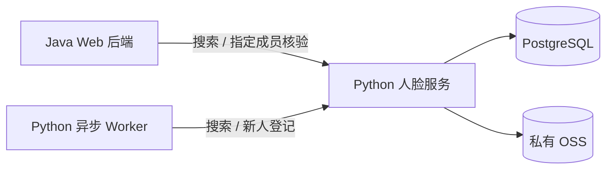

# 人脸服务调研与推荐方案 V1：当前 MVP

更新日期：2026-09-10

状态：调研结果与工程建议，尚未完成设备 PoC、采购或生产接入。

适用范围：Java Web 后端、Python 异步 Worker、Android APP、手机号登录；依据本目录 [技术架构](技术架构设计-V1-MVP.md)、[数据架构](数据架构设计-V1-五模块-MVP.md) 及现有用户用例。

## 1. 当前结论与推荐

**MVP 优先采用成熟云端人脸服务，以阿里云视觉智能开放平台作为首个接入验证对象；现有 face-insightface-server 暂不直接承担正式身份准入。** 腾讯云保留为对照候选，尤其适合验证“按人员 ID 核验当前照片”的路径。

推荐依据是已有接口覆盖与当前工程缺口，不是识别准确率排名，也不是已经批准采购：

- 阿里云已提供人员库管理、1:N 搜索和两张照片 1:1 比对，可覆盖核心身份流程；我们仍须实现业务权限、采集与活体衔接、可靠新人判定和跨系统去重。
- face-insightface-server 已是一个可调用的识别服务原型，不只是裸算法库；但稳定人员引用、持久化一致性、指定成员核验和服务防护尚未完善，直接复用会把这些开发工作引入 MVP。
- 自建服务可保留为后续自托管路线。模型授权、人员库一致性和准入缺口解决后，再与云服务做同设备对照，不提前承诺成本更低或准确率更高。
- 专业测肤与人脸身份识别分开：本报告回答“照片里的人对应哪个成员”，不验证皮肤分析能力。

先前广泛云服务调研把腾讯云列为优先验证对象，主要因为其指定人员核验接口直接。当前推荐阿里云先做 PoC，是结合本轮用户重点评估阿里云、以及本地项目暂不能直接复用后的实施顺序建议；未获得新的识别率实测，不应解读为阿里云效果优于腾讯云。

## 2. 我们需要什么能力

| 场景 | 需要的能力 | 业务处理与边界 |
|---|---|---|
| 云台测肤，识别当前人员 | 1:N 人脸搜索、人员库管理 | 在已登记成员中寻找可靠匹配；不确定就重拍/重试，不开放成员历史 |
| 云台确认新成员并归档 | 质量检查、受控采集、搜索查重、稳定人员登记 | 未命中仅是新人候选，不立即创建正式成员；验证后才开放自动建档 |
| APP 刷脸关联已有成员 | 1:N 搜索，必要的同人核验与活体 | Java 建立长期、可撤销的查看关系；该入口不创建成员 |
| 护理开始/恢复 | 针对方案成员的 1:1 核验 | 即使当前人匹配库内另一个成员，也不能继续原方案 |
| 持续追踪与换人发现 | 端侧检测/追踪 | 由云台/客户端负责，云服务不承担每帧实时护理控制 |
| 防照片/视频冒用 | 与本次身份采集绑定的活体/挑战方案 | 身份相似度不证明现场性；仅上传照片不能当完整防重放协议 |

前两类身份搜索、护理前核验和活体是不同能力；人员 ID、单张照片 ID、一次核验请求 ID 也不能混用。

## 3. 国内云服务调研概览

本节汇总 2026-09-10 独立调研会话的官方资料核查。标记“支持”表示公开接口有该能力，不表示在我们的设备上通过验证。

| 方案 | 人员库与稳定引用 | 1:N 搜索 | 1:1/指定人员核验 | 当前判断 |
|---|---|---|---|---|
| 阿里云视觉智能开放平台 | DbName + EntityId；单张照片 FaceId；支持一人多图 | SearchFace | CompareFace 比较两张照片 | 核心功能可行，作为首个 PoC 对象；需私有参考照管理 |
| 腾讯云人脸识别 | PersonId 与 FaceId 分离，可关联人员库 | 支持 | VerifyPerson 可按 PersonId 验证照片 | 作为重点对照候选，指定人员核验接入直接 |
| 百度智能云人脸识别 | 应用/group_id 范围下 user_id，入库照片有 face_token | 支持 | 支持人脸比对 | 保留备选；核查具体活体 SDK、设备与计费组合 |
| 中国移动相关政企人脸产品 | 官方页面确认库管理；稳定人员层级、一人多图等细节未确认 | 官方页面确认 | 官方页面确认人脸比对 | 不是“不支持”，而是公开 API 证据不足，需完整接入资料 |
| 本地 face-insightface-server | name → 单向量，文件名影响恢复，尚非可靠人员主键 | 简易 Top 1 | 没有对应公开路由 | 识别原型可复用，当前不能直接用于正式身份准入 |

官方入口：[阿里云搜索](https://help.aliyun.com/en/viapi/developer-reference/api-t00lyd)、[腾讯云指定人员核验](https://cloud.tencent.com/document/api/867/44982)、[百度搜索](https://cloud.baidu.com/doc/FACE/s/Gk37c1uzc)、[百度人员库管理](https://cloud.baidu.com/doc/FACE/s/Fm9qshzsl)、[中国移动人脸搜索产品页](https://www.jl.10086.cn/ecloud/product-introduction/facesearch.html)。

本版不重复列容易变动的单次价格作为采购结论。实际成本应按一次成功业务操作中的检测、活体、搜索、比对、重试、SDK 及存储合计，并确认账号实际额度。自托管还包含算力、维护和模型授权成本，目前没有足以证明哪条路线总成本最低的数据。

## 4. 阿里云：可用能力与具体接法

### 4.1 能力与 API

| 作用 | 接口 | 输入/产出与适配注意 |
|---|---|---|
| 建库与人员登记 | CreateFaceDb、AddFaceEntity、AddFace | 库内人员使用 EntityId，照片使用 FaceId；由后端维护成员映射 |
| 判断当前人员是谁 | SearchFace | 当前照片与指定库范围，返回候选人员、照片引用及相似度；不能拿最高分就无条件放行 |
| 判断是否方案本人 | CompareFace | 当前照片 + 该成员可信参考照片；本次核实接口不接收 EntityId 替代第二张图 |
| 图片活体检测 | DetectLivingFace | 图片静默活体，需和同一次身份采集绑定；不能视为已具备随机动作挑战 |

依据：[AddFaceEntity](https://help.aliyun.com/en/viapi/developer-reference/api-add-face-entity)、[SearchFace](https://help.aliyun.com/en/viapi/developer-reference/api-t00lyd)、[CompareFace](https://help.aliyun.com/en/viapi/developer-reference/api-fomc02)、[DetectLivingFace](https://help.aliyun.com/zh/viapi/developer-reference/api-j81gjl)。

### 4.2 三条业务链路

**云台测肤身份归档：**新测肤受理并转为唯一当前任务 → Python Worker 对固定照片版本做身份处理 → 查询云端人员库 → 可靠匹配则关联 member_id；不确定不归档；可靠新人候选经过查重和登记可见性确认后才完成成员建档。身份归档可随现有测肤异步任务处理，不新增云台历史识别入口。

**APP 获取查看授权：**已登录账号发起本次受控采集 → Java 同步调用人脸能力识别已有成员 → 通过业务检查后写 member_access_grants。未匹配不建成员，旧请求不能复活已撤销授权。

**护理开始/恢复：**Java 读取方案所属 member_id 及可信参考照 → 当前照片与参考照调用 CompareFace → 通过后在短事务中重检权限、当前任务与微晶占用 → 登记/恢复原执行。同步请求不排入 Worker 队列等待；旧核验结果不能跨成员、执行和采集会话复用。

Java/Python 都经各自适配代码调用同一约定的云服务，不要求共用可执行代码；共同遵守人员引用、状态、版本及照片用途契约。参考照由私有 OSS 保存和受控读取，不能由客户端任意提交第二张图决定“本人是谁”。

### 4.3 尚需验证的地方

- 云台与 Android 手机跨设备识别、不同光照/角度/妆容下的通过率、错认与不确定情况。
- 静态活体是否足以满足实际采集环境，是否需要另外接入 APP SDK/视频挑战；不能把云 API 调用 SDK 当作摄像头活体 SDK。
- 单人质量准入。部分接口自动选择最大脸不等于业务已经排除了多人混入。
- 人员登记与索引生效延迟、请求超时后的对账、并发注册防重；不推定供应商具备全局自然人原子去重。
- 实际库容量、调用额度、完整链路费用及数据处理/删除条款。AddFaceEntity 文档列有容量约束及长期未调用特征冻结策略，稳定 ID 不代表算法资源永远可用。[官方限制与生命周期](https://help.aliyun.com/en/viapi/developer-reference/api-add-face-entity)

## 5. 本地 face-insightface-server 的现状

来源为医疗云平台项目内的[隔离代码调研报告](references/face-insightface-code-review.md)。本稿引用其结果，不复制或修改该仓库业务代码。

- 实际仓库：face-insightface-server。
- 核查基线：本地 dev `db1b4a7ad3e8f246a080cbb22caf470b5f56cc44`。
- 隔离评审分支：architecture/face-mvp-review；报告尚未合入该项目 dev，不声称对应远端最新实现。
- 本次没有运行模型、上传真实照片、压测或检查实际部署权重，因此源码结论不能直接等同于现网表现。

### 5.1 已实现的接口

| 接口 | 已实现能力 | 当前限制 |
|---|---|---|
| POST /recognize | 上传照片，逐脸提特征并返回 name、score、bbox | 仅 Top 1；无质量/活体/不确定分类；无法解码也可能返回 HTTP 200 错误体 |
| POST /register | 按 name 写照片、提取并保存向量 | 注册只选最大脸；同名覆盖；无稳定人员层级和原子去重 |
| POST /reload | 从磁盘重建内存/cache | 重载与在线修改、多进程间缺少一致性保证 |
| POST /delete | 按 name 删除 | 内存、文件和缓存可能部分成功，重启后状态可能不一致 |

默认阈值 0.45 是归一化特征点积的判定值，不是“45% 可信”，也不能直接套用阿里云的同数值阈值。库代码能提取 embedding，不代表项目已经提供完整人员库、质量准入或活体能力。

### 5.2 直接复用的主要缺口

| 问题 | 已核查现象 | 对我们用例的影响 |
|---|---|---|
| 稳定 ID 不可靠 | 注册 member_001，重载按下划线取第一段可能变成 member | 报告和成员映射可能失效或归错人 |
| 一人多图覆盖 | 内存仅 name → 一个向量，多文件重载相互覆盖 | 不能作为可靠多参考照人员库 |
| 写入/删除不一致 | 先写文件后校验、删除中途失败缺少整体回滚 | 失败重试与重启恢复可能改变身份库 |
| 没有指定成员 1:1 API | 只有全库搜索入口 | 护理前核验需要补接口与对应判定，不能直接用“全库最高分”代替 |
| 无质量/活体/不确定判断 | Unknown 混合低分、空库等情况 | 不能直接 Unknown → 新建成员 |
| 无服务认证与并发去重 | 仓库未实现凭据校验、原子注册与多副本同步 | 需要额外工程建设，不能直接暴露给客户端 |
| 部署和实测证据不足 | 未提供测试、容器/健康检查、容量/延迟基准 | 不能按原型推断产品级稳定性 |

原始证据路径及函数行号保存在上面的隔离调研报告中。部署外部是否另有网关、是否修复过这些问题未验证，结论限定为所核查代码基线。

### 5.3 模型许可

代码配置 buffalo_l，依赖锁定 InsightFace 0.7.3。该版本官方说明区分了库代码的 MIT 许可与预训练权重的使用条件；提供的预训练权重默认限非商业研究。仓库未发现额外授权材料，不能据库 MIT 标签推断模型商用已获许可。[InsightFace 0.7.3 官方说明](https://pypi.org/project/insightface/0.7.3/)、[官方仓库模型授权说明](https://raw.githubusercontent.com/deepinsight/insightface/master/README.md)

实际运行模型的来源、哈希、是否替换及是否另有授权尚未核实。自托管路线进入商业试用前，应取得实际模型可用范围的明确证据，或使用已获相应授权的模型；本次没有联系许可方或购买授权。

### 5.4 自托管路线的 MVP 改造范围

本节记录采用 face-insightface-server 时需要的改造方案，不表示已决定替换阿里云，也不表示这些改造已经实现。重点是把识别原型补成可靠的人员管理和身份核验服务，不要求重新开发识别算法。

| 必需改造 | MVP 处理方式 | 验收重点 |
|---|---|---|
| 稳定人员 ID | 使用不可变 person_id；姓名、文件名与人员引用分开，参考照片各有独立引用 | 注册、重载、重启后人员 ID 一致；member_001 不会变成 member |
| 可靠持久化 | PG 保存人员、参考图引用、特征、状态和版本；内存索引可重建，缓存不作为权威数据 | 注册/删除中断后可恢复或对账，删除后重启不复活 |
| 指定成员核验 | 增加 verify(person_id, image)，由服务读取该人员可信参考特征 | 另一位已登记成员也不能通过原方案核验 |
| 明确结果分类 | 区分可靠匹配、无可靠匹配、无法判断、图片不合格；阈值由服务端固定策略控制 | 不将 Unknown 或最高分直接当作新人或准入结论 |
| 单人及质量检查 | 检查无人、多脸、脸部尺寸、严重模糊、姿态等，输出可理解的补拍原因；具体检测实现需验证 | 多脸不能自动取最大脸后放行，低质量不导致错误建档 |
| 注册查重与幂等 | 对人员库变更串行处理；固定请求标识与人员引用，登记前查重，超时可查询结果 | 同请求重试不重复建档；同人不同请求并发仍须重新查重 |
| 服务防护 | 仅供可信后端调用，校验服务凭据、图片大小与类型；不接受任意文件路径或客户端阈值 | 无凭据不能登记/删除，异常输入不覆盖旧数据 |
| 模型与运行保障 | 固定模型、特征维度、预处理及阈值策略版本；健康检查区分进程存活与索引就绪；记录请求与错误 | 未就绪时拒绝身份判断；不同模型版本向量不能混算 |

只修复文件名下划线问题不足以满足 MVP。写入一致性、人员引用和索引恢复必须一起处理。PG 与 OSS 没有共同事务：先校验图片，以待完成/可用/删除状态和重试对账协调对象操作；搜索仅使用可用记录。登记返回成功前确认索引已可见，不能让刚登记的人员立即被再次识别为新人。

### 5.5 建议提供的后端 HTTP 接口

以下是算法服务的接口能力草案，路径与请求字段待实施时确定；由 Java Web/Python Worker 调用，不计入面向 APP、云台的现有 27 个业务 API。

| 接口能力 | 目的 | 调用方 |
|---|---|---|
| 搜索人员 | 上传当前照片，返回候选 person_id、分数、明确结果分类及策略版本 | Java / Python Worker |
| 登记人员 | 在受控新人流程中登记人员与参考特征，支持幂等请求 | Python Worker |
| 核验指定人员 | 指定 person_id 与当前照片，返回同人核验结果 | Java |
| 查询登记状态 | 注册超时后按请求标识或已确定的人员引用对账 | Java / Python Worker |
| 删除人员及特征 | 删除算法侧数据并可靠同步索引，重复删除具有明确结果 | 受控后台操作 |

原 /reload 改为内部管理操作，业务正确性不能依赖调用方手动刷新索引。删除算法人员不隐式撤销账号授权或删除业务成员；人员登记也不自动授予账号查看权限。

### 5.6 存储与运行方式

建议复用现有 PostgreSQL 实例和私有 OSS，不增加向量数据库、Redis 或消息队列。

- 算法服务在独立 schema 管理自己的数据，MVP 可先用一张人员宽表保存 person_id、少量参考图与特征、模型版本、状态、登记请求标识和数据版本。具体字段需在选用自托管后细化。
- 图片放私有 OSS，算法表保存对象引用；按用途管理保留时间，临时核验图片不默认永久保存。
- PG 为权威数据源，内存负责特征检索并可从 PG 重建；上线前确认容量和实际延迟。
- 初期单实例、单进程，串行处理人员库变更，不做多副本同步索引；该限制只针对人脸服务，不限制 Java Web。搜索须读取一致索引版本，重启就绪前不接身份业务。
- 算法 schema 的迁移由明确的单一负责人管理，与业务表迁移划清所有权；Java/Worker 通过服务接口使用算法数据，不直接改算法表。

**现有业务架构仍是 14 张业务表；自托管候选方案另建议至少一张算法服务表。** 不能把它表述为整个系统仍只有 14 张表。第 6 节的现行字段建议以云服务路线为基础，本节尚未修改正式表清单或执行迁移。

增加独立同步 Python 人脸服务，避免身份核验等待测肤/生成方案队列：

Python 人脸服务与 Python 异步 Worker 分开运行，不在每个 Worker 中维护一套人员索引。云服务路线无需新增这个自建进程。

### 5.7 接入前提、实施顺序与暂缓事项

活体与模型许可仍是独立前提：当前服务没有活体能力，相似度不能证明现场性；APP 获取长期查看授权需要与本次采集绑定的活体方案。实际权重的使用许可按第 5.3 节核实，不能以库代码 MIT 许可代替模型授权。

建议实施顺序：

1. 先补稳定 ID、持久化一致性、指定成员核验、质量判断和幂等登记；同步落实服务认证及模型版本约束。
2. 用授权测试数据验证注册、删除、重启、请求超时、并发和索引恢复；确定活体接入及模型许可。
3. 用真实云台与 Android 做跨设备识别、护理本人核验、自动新人建档和活体/重放测试，复用第 7.2 节业务验收清单。
4. 确认容量、延迟和故障恢复满足需要后，再决定是否替换云服务候选路线。

MVP 暂缓管理界面、分布式部署、向量库、多模型切换和多云自动切换。自动新成员建档仍在现有用例范围内，必须验证老成员换光照/角度后不会被直接重复建档；单进程和串行注册只能处理工程竞态，不能消除算法误判。

## 6. 对当前数据架构的建议

当前云服务路线的原则：继续 14 张业务表和宽表设计，**不因为调研发现一人多图就立即新增人脸照片表、向量库或身份映射服务**。以下为实施前字段细化建议，不是已经执行的数据库迁移。

| 位置 | 建议 | 理由 |
|---|---|---|
| members.id / member_id | 保持后端自有成员主键 | 不依赖云厂商实体或本地 name 的生命周期 |
| members.face_subject_ref | 阿里云接入时明确保存 EntityId；若改名为 face_person_id，统一替换而不同时保留两个同义字段 | 人员引用不等于 FaceId 或照片 URL |
| identity_namespace | 当前按单库配置维护；若沿用已有列，写入统一且可追溯的配置引用 | 单库不需要多库管理界面；更换库不能让旧映射被误解释 |
| members.identity_summary | 增加结构化的登记状态、配置/策略版本、可信参考图 media ID，必要时保留少量 FaceId 清单 | 初期利用已有 JSONB 宽表，避免拆分多张从属表 |
| media_objects | 沿用现有对象表记录图片和成员/请求归属 | 参考照与临时核验照应在用途/保留策略上区分；目的枚举在实施前同步细化 |
| idempotency_requests / async_jobs | 复用请求、任务去重与登记对账信息 | 云端成功、PG 未提交时可恢复同一人员，不盲目重建 |
| member_access_grants | 保持现有授权表与撤销规则 | 不沿用调研草稿中的 account_member_access 等其他命名，避免重复造表 |

未确认身份的测肤任务保持 member_id 为空。云端入库与 PG 不存在共同事务，应以预先确定的人员引用和幂等键对账；在身份可用前不开放授权或护理。后端串行注册也不能单独消除外部索引延迟，需要确认写入可见后再结束登记流程。

删除算法模板、撤销账号查看权和删除业务成员是三件不同的事，不能互相隐式触发。继续沿用已确定的图片保留原则：报告用图随报告、参考照按算法需要、临时核验照不默认长期保留。

## 7. MVP 接入建议与验证顺序

### 7.1 第一阶段：验证能力，不扩大业务范围

以阿里云测试库和经授权的测试照片验证现有完整用例；固定服务配置、阈值策略和采集流程，记录真实设备结果。已有成员识别与自动建档分别验收，自动建档未验证通过不能假装已覆盖该用例。

不新增人工选人、人工强制通过、后台合并成员、多云自动切换、多个模型并跑等产品流程。无法可靠判断时沿用补拍/重试或失败状态；是否需要额外例外流程以后单独评估。

### 7.2 PoC 验证清单（尚未执行）

| 验证项 | 操作 | 需要证明什么 |
|---|---|---|
| 跨设备识别 | 云台登记、Android 搜索，反向再测 | 同一成员稳定匹配，参考照与测试照独立采集 |
| 指定成员核验 | 原成员与另一成员分别尝试同一护理方案 | 原成员可正常通过，其他成员不被放行 |
| 老成员误建档 | 更换角度、光线、妆容、遮挡后搜索 | 低质量/不确定不会创建新成员 |
| 真实新人登记 | 留出未入库测试者，登记后立即搜索 | 登记成功可检索，任务、人员 ID 与参考照一致 |
| 重试与并发登记 | 同人多设备提交、模拟响应丢失 | 不因重试生成多份正式成员，能够对账恢复 |
| 活体与请求绑定 | 打印照/屏幕翻拍、旧核验结果、跨账号拼接 | 不能借重放获得授权或护理准入；达不到要求则补采集方案 |
| 多脸与歧义 | 多人入镜、相近候选、临界分 | 明确重拍/不确定，不只取最大脸或最高分放行 |
| 外部服务故障 | 超时、限流、库失效、索引未就绪 | 不错误建档，不绕过准入；可恢复或明确失败 |
| 权限与历史范围 | 云台请求旧任务、APP 撤销后访问 | 识别命中也不能越权查看历史和图片 |
| 成本与响应时间 | 统计完整成功链路及重试 | 得到实际每次操作费用、延迟和额度要求 |

小规模测试能发现工程问题，不能证明极低误识率。阈值和通过标准应依据实际设备、样本与业务要求确定；不直接将供应商参考阈值当作本项目验收结果。

### 7.3 决策节点

- 若阿里云 PoC 覆盖当前用例且成本/开通条件可接受，再确定正式接入。
- 若主要困难是指定成员核验、活体接入或设备效果，使用同一批样本对照腾讯云等候选，避免靠宣传资料更换供应商。
- 若存在明确自托管需求，再对 face-insightface-server 的修复、模型授权和运维投入单独估算，不把原型修复默认为免费。
- 供应商选择不改变 Java 掌握业务权限、Python 执行测肤异步任务、端侧负责持续追踪和微晶控制的边界。

## 8. 本次更新范围

本报告汇总国内云服务调研与 face-insightface-server 的隔离代码审查，补充当前 MVP 推荐。技术架构中的“调研尚在进行”更新为“调研已完成、推荐阿里云先 PoC、尚未正式选定”；数据架构增加本报告引用，字段细化建议与现行字段定义保持区分。

本轮未开通付费服务、未上传真实人脸、未修改算法代码或数据库、未更新本地/远端网页。网页后续同步以本目录文档为来源。
