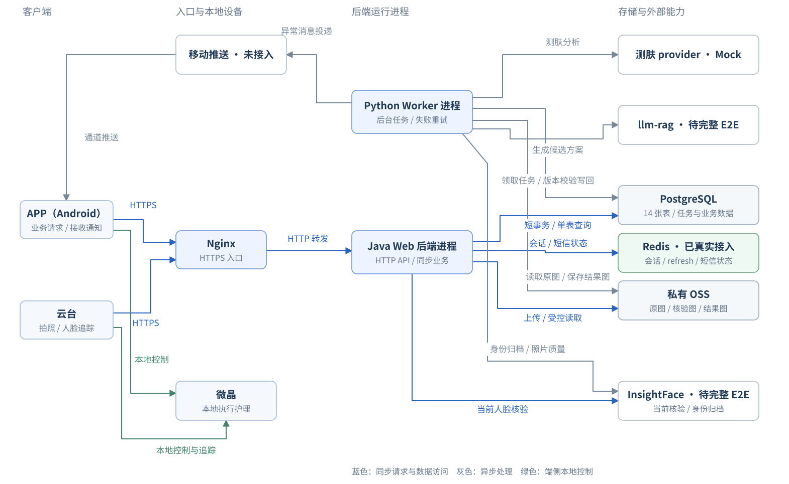

# 技术架构设计 V1：MVP 后端

日期：2026-09-15

状态：实现与联调同步稿；实现基线 `dev@ffaa0c3`，后端目标环境部署版本仍待核验。

依据：[数据架构设计](数据架构设计-V1-五模块-MVP.md)、[HTTP API 设计](后端API接口设计-V1-五模块与流程对应.md)、[运行组件说明](运行组件说明.md)、[测试决策记录](测试需求决策记录.md) 和 [测试场景清单](测试场景清单-V1-五模块与双控制.md)。本文描述这些设计如何由程序、数据库和外部服务实现，不重新定义已确认的业务规则。

## 1. 技术方案结论

采用 **Java 模块化 Web 后端 + Python 异步 Worker + PostgreSQL + Redis + OSS**：

- Web 后端使用 Java，异步 Worker 暂时使用 Python，复用现有 Python 算法与大模型接入代码。M1—M5 保持逻辑模块划分；两端是不同工程、不同依赖、不同镜像，不再描述为同一份业务代码的两个启动入口。MVP 可同仓管理，仓库组织不是进程通信方式。
- 一个 PostgreSQL 业务库，沿用 14 张表，包括 accounts。采用宽表和 JSONB，业务 SQL 默认不写 JOIN；分步查询和批量查询在应用层组合。
- 五个运行组件仍是 Nginx、Web 后端、PostgreSQL、异步 Worker、OSS。组件不等于服务器，不将五模块拆成五个服务。
- HTTP 请求负责认证、准入、查询和短事务；测肤、方案生成、离线扫描、通知投递由 Worker 持久化执行。护理前的人脸核验仍在 HTTP 请求内完成。
- PG 保存任务队列、请求去重、次数账本及业务生命周期；Redis 保存 APP 会话、refresh 轮换、短信验证码状态与限流。仍不增加独立 MQ、服务注册中心或 Kubernetes。
- APP/云台本地控制微晶；后端不转发启动、暂停和停止。网络故障不能让后端假装硬件已停止。

Java Web + Python Worker 是已确认的语言划分，具体框架和库仍是建议，不代表已有代码已采用；本次只读取设计文档，未检查其他工作树业务代码。人脸服务调研已完成：推荐阿里云先做设备 PoC，腾讯云保留为对照候选；现有 face-insightface-server 不直接承担正式身份准入。供应商尚未最终确定，接口能力确认不等于设备实测通过，详见 [人脸服务调研与推荐方案](人脸服务调研与推荐方案-V1-MVP.md)。

已确认的 MVP 范围：手机号登录；客户端先支持 Android；报告展示所需图片随报告保存，人脸参考照片按算法需要保存，临时身份核验照片不默认长期保存，具体清理周期在真实用户试用前确定。

## 2. 建议技术栈及选择理由

| 层次 | MVP 建议 | 选择理由与约束 |
|---|---|---|
| Web 语言及 HTTP 框架 | Java（已确认）+ Spring Boot / Spring MVC（建议） | 负责 APP/云台对外 API、认证授权、准入及短事务；先用常规请求线程模型 |
| 数据校验 | Java DTO + Bean Validation；Python Pydantic | 分别校验请求/响应及任务输入/结果；两端使用同一套版本化 JSON 契约和示例验证 |
| 数据访问 | Java：Spring JDBC；Python：SQLAlchemy Core + PG 驱动 | 两端均显式单表 SQL、参数绑定、批量操作；默认不写 JOIN，不依赖 ORM 自动关联 |
| 数据库迁移 | 一套 SQL 迁移，建议统一由 Flyway 执行 | Java 项目维护唯一迁移入口，覆盖 Worker 使用的表；不再维护另一套 Alembic 迁移，发布时只执行一次 |
| 主存储 | PostgreSQL | 14 表的事务、唯一约束、行锁、JSONB 与持久队列共用一库 |
| 图片存储 | 私有 OSS | 原图、核验图和测肤结果图统一管理；PG 不保存图片二进制 |
| 异步工作 | 独立 Python Worker，消费 async_jobs | 避免 HTTP 进程退出丢掉已受理任务；先不引入 Celery 和额外 broker |
| 外部服务访问 | 有限连接池的 HTTP 客户端/厂商 SDK | 统一连接超时、响应超时、错误归类和重试；SDK 是否阻塞需分别验证 |
| 入口与部署 | Nginx + Linux 容器，MVP 可用 Docker Compose 管理 | 四个自建组件可先共机；OSS 独立，生产数据使用持久卷 |
| 测试 | Java / Python 各自单测 + 真实 PG 集成测试 + 跨语言契约测试 | 行锁、唯一约束、JSONB 和并发行为不以 SQLite 模拟结果替代 |

语言按用户决定执行，Spring Boot、Spring JDBC、Flyway 和 Python 数据访问库属于参考选型，实施时与已有工程对齐并锁定受支持版本。Java 用 Spring JDBC 实现显式查询，用 TransactionTemplate 等方式包住需要的短事务；Python 用独立数据库事务提交任务结果。两端事务不能跨进程传播。参考 [Spring JDBC 官方文档](https://docs.spring.io/spring-framework/reference/data-access/jdbc/core.html)、[Spring 编程式事务文档](https://docs.spring.io/spring-framework/reference/data-access/transaction/programmatic.html) 和 [SQLAlchemy 事务文档](https://docs.sqlalchemy.org/en/20/core/connections.html)。

## 3. 运行组件与通信



图按固定位置排版：APP / 云台 → Nginx → Web 后端进程；异步 Worker 位于 Web 后端正上方，存储与算法服务位于右侧。推送通道向左回传 APP，不改变主请求链路的阅读顺序。

[查看 Mermaid 通信关系源码](assets/runtime-components.mmd)（自动布局的位置可能与上图不同，以固定布局图为准）。

人脸识别、皮肤分析和大模型是不同能力，即使未来采购同一厂商产品，也保持不同的适配职责。服务端与微晶之间没有控制通道。图中的推送表示通道能力，不保证每条消息实际送达。

### 3.1 网络边界

- 客户端只访问 Nginx 暴露的 HTTPS 入口；Web 和 PG 不直接开放公网访问，Worker 不对外提供业务 HTTP 端口。
- Nginx 校验上传大小、配置连接限制并转发请求；只有受信代理提供的转发头可用于真实客户端地址识别。
- Web 执行账号/云台认证及资源权限校验，不能因经过 Nginx 就省略鉴权。
- OSS 使用私有对象；Web/Worker 采用各自最小权限的运行凭据，密钥不进入客户端、数据库 JSON、Git 或日志。
- 开发、测试、生产分别使用数据库、对象前缀/存储桶、外部服务凭据与测试推送目标，避免测试图片和通知混入真实用户。

Nginx 的代理超时与缓冲需要和上传、图片流及核验接口分别匹配，不能统一无限等待。相关配置语义见 [Nginx HTTP 代理模块文档](https://nginx.org/en/docs/http/ngx_http_proxy_module.html)。

### 3.2 与当前文档网页的关系

现有 Sites 网页是静态设计参考站，展示模块、图、API、测试与数据架构，**不是本技术架构中的业务 Web 后端**。它不连接这里的 PG/OSS，不运行人脸核验，也不把真实人脸上传到文档托管服务。更新文档站不等于部署护理业务系统。

## 4. 工程组织与模块依赖

建议以业务模块为主目录，每个模块内部保留简单的入口、服务、数据访问和数据结构文件，不为每张表生成一套多层抽象。

```text
backend/                           # 建议同仓目录；不创建新仓库
  web-java/
    src/main/java/.../
      identity/                    # M1：账号、查看授权、身份核验入口
      devices/                     # M2：绑定、设备会话、心跳和能力
      assessments/                 # M3：任务受理、补拍和查询
      care/                        # M4：执行、占用、实际记录与 K
      notifications/               # M5：推送目标登记
      infrastructure/              # 认证、数据库、OSS、人脸 HTTP 适配
    src/main/resources/db/migration/ # 全库唯一迁移来源
  worker-python/
    worker.py                      # 任务领取、续租、结果提交
    handlers/                      # 测肤、身份归档、方案、通知、清理
    providers/                     # 现有 Python 算法和大模型集成
    repositories/                  # 限定字段写回，不复制 Java 业务层
  contracts/                       # 任务 JSON Schema、状态码、规范化规则与样例
  tests/                           # 跨语言任务、事务与兼容性验证
  deploy/                          # 两份镜像与统一发布配置
```

Java 模块从 Controller、Service、Repository、DTO 几类职责开始；Python 从 Handler、Provider、Repository、任务输入/结果模型开始，不机械复制整套五模块 HTTP 服务。两边独立连接池、独立事务；同步 SDK 使用有上限的并发，不把网络调用放进数据库锁区间。

| 模块 | 写入权威 | 跨模块协作方式 |
|---|---|---|
| M1 | 账号、人员档案、授权状态 | 给调用流程提供认证主体、成员身份和授权判断；M3 经 M1 完成可靠建档 |
| M2 | 设备标识、绑定、心跳与能力 | 暴露当前设备上下文；M3 的当前任务指针是预先约定的跨模块字段写入例外 |
| M3 | 测肤任务、输入版本、正式报告 | 报告就绪事务建立 M4 方案待办；不给云台历史搜索能力 |
| M4 | 方案、执行、微晶占用和次数 | 从 M1/M2/M3 读取必要事实，跨表事务由一个应用服务统一提交 |
| M5 | 推送目标、通知状态 | 使用 M2 当前绑定和异常事实，并在投递前重检 |

上述表格是领域职责，不意味着每个领域只能由一种语言执行。Java 内部跨模块使用普通方法调用和同一事务上下文；Python 内部独立组织任务事务。Java 与 Python 通过 PG 工作项交接，不调用彼此代码，不增加任务回调 HTTP API，也不使用跨语言分布式事务。Repository 不自行提前提交。

### 4.1 Java 与 Python 的写入边界

| 数据 | Java Web 负责 | Python Worker 负责 |
|---|---|---|
| accounts、member_access_grants | 账号及授权建立/撤销 | 不修改账号或授予查看权 |
| members | 查询成员、同步核验所需身份引用 | 测肤阶段可靠身份归档；不复制 APP 授权逻辑 |
| gimbals、microcrystals | 绑定、当前任务指针、心跳、能力与状态观察 | 仅按条件维护离线/异常派生状态；不能改绑定和当前任务指针 |
| skin_assessments | 受理、照片版本、重试所需输入状态 | 依据输入版本写分析状态、成员归属、正式报告 |
| care_plans | 准入时读取；实际记录入账时更新 K/完成时间 | 建立待生成方案并写方案、N 和生成状态；不覆盖 K/完成时间 |
| care_executions、care_records | 所有生命周期、占用、次数账本与同步收尾写入 | 不更改执行、不累计 K、不释放占用 |
| notification_destinations、notifications | 目标登记；心跳异常时可同事务建立通知和工作项 | 离线扫描建通知、投递前重检、更新投递结果 |
| media_objects、async_jobs、idempotency_requests | 请求图片、创建任务和请求去重 | 自己任务的图片、任务领取/结果状态；不改 HTTP 请求去重结果 |

共享表使用字段级 UPDATE，不使用整行保存或 upsert 覆盖未归本端负责的字段。报告发布、建立方案待办及入队由 Python 在一个 PG 事务提交；Java 原子受理新任务与入队是另一个事务。异步阶段失败不会回滚已受理的 HTTP 事务，而是更新任务状态并按协议重试。

### 4.2 最小跨语言任务契约

async_jobs 的 job_type、owner_id、input_revision、dedup_key 和 payload 是交接协议。payload.schema_version 标识结构版本，payload 只放 JSON 数据和受控资源引用，不传 Python 对象、pickle、Java 类名或可执行代码。

统一 UUID 文本形式、UTC 时间格式、状态编码、计数整数范围和请求哈希规范；计数不能中途转换为浮点数。共用契约样例分别在 Java/Python 验证，同一业务输入必须得到一致摘要。不认识的任务类型/版本明确记录不支持并隔离处理，不能记成功或无限立即重试。

Java 写入工作项后提交即完成交接；Python 领取、调用算法/大模型并在短事务中按租约代次和输入版本写回；Java 查询 PG 获取已发布结果。不让 Java 通过等待队列结果来实现同步人脸核验，也不引入额外消息中间件。

### 4.3 同步人脸核验的调用方式

M1-A01、M4-A03/A04 仍由 Java 在请求内调用所选人脸服务的 HTTP API/Java SDK，拿到当前核验结果后执行授权或准入事务。人脸供应商有 HTTP 接口时，不需要因 Worker 使用 Python 就绕行 Worker。

现有 Python 算法和大模型代码由 Worker 导入调用或调用其已有服务；本稿不假定 Python 模块已暴露 HTTP。如果未来必须让 Java 同步调用一段只能在本地 Python 中执行的人脸逻辑，需要明确增加内部同步服务及其运行入口；这是额外组件能力，本 MVP 暂不假装异步 Worker 已承担该服务。算法语言与进程间通信协议是两回事。

## 5. 数据访问：默认不写 JOIN

### 5.1 单表读与应用层组装

遵循数据架构第 12 节的 27 个 API 查询路径。认证层读取 accounts 后传入本地 account_id；业务表中的账号字段统一 uuid 外键，不使用供应商 subject 作为业务主键。

例：APP 查看成员报告列表：

1. 认证层单独核对 accounts.status/auth_revision，建立账号上下文。
2. 单表查询 member_access_grants 的有效关系。
3. 单表按 member_id 分页查询 skin_assessments 的 report_summary。
4. 白名单组装响应，返回报告引用；不逐份查询 members、care_plans 或 media_objects。

例：APP 查看方案详情：先查 care_plans 得到 member_id，再查授权关系；通过前不输出方案正文。展示使用 plan_summary，执行历史使用 plan_snapshot。K、当前授权和云台当前任务仍读权威行，不复制到其他表作为实时判断。

批量补充数据使用 `WHERE id = ANY(...)`，应用层按 ID 映射；批量大小与分页上限由配置限制。禁止 ORM 自动关联查询、关联子查询、隐式 JOIN 或循环 N+1 查询。数据库外键不是 JOIN，继续保留。

### 5.2 查询一致性与性能

- 查询次数统计区分认证 SELECT、业务 SELECT 和写入语句；“通常两次业务查询”不等于整个 HTTP 请求只有两条 SQL。
- 使用明确列投影，列表不取整个 report_payload/plan_payload；JSONB 只为真实查询需求建索引。
- 分步读取存在时间间隔，权限校验是本请求的判定点；已下载的内容无法被数据库撤回。准入和写入需要在事务内重检，不能凭先前查询放行。
- 初期权限、K、占用、当前任务均从主库读取，不引入从库延迟或跨进程内存缓存造成判断过期。
- Web/Worker 各有有限连接池。数据库连接预算覆盖“Web 实例数 × 每实例连接上限 + Worker 连接上限 + 迁移/运维预留”，不简单把进程数翻倍而忽略 PG 连接上限。

## 6. 认证与授权

### 6.1 APP 账号

外部登录身份验证成功后，根据 `(login_provider, login_subject)` 唯一键定位/创建 accounts，再签发或映射业务认证上下文。账号状态和认证代次用于禁用与账号级凭据失效。已确定先采用手机号登录，不扩展微信、多种登录方式关联或账号合并。手机号验证、会话刷新及退出的 HTTP 契约由开发补齐；验证码/认证供应商尚未选定。

请求上下文至少有 account_id、installation_id、可验证的会话身份和请求标识。installation_id 不等于认证凭据，不能只知道该值就冒充设备。单个安装退出由会话协议处理，同时使推送目标失效；账号级 auth_revision 用于全账号失效，不滥用于单设备退出。

当前 14 表没有独立 refresh/session 表。实施前必须明确选择可验证会话提供方或另行设计会话存储，不能宣称 accounts + 一个 JWT 就已支持单实例即时退出、刷新与撤销。若自建会话需要增加表，先更新数据架构；这里不偷偷扩大已确认的表清单。

### 6.2 云台

云台使用独立设备凭据，不借用绑定账号登录。设备会话校验云台主体及 credential_version；配对证明由可信协议验证，并绑定操作主体、云台、挑战和有效上下文，不把 gimbalId 当作证明。凭据轮换、防重放格式及具体有效时长在设备对接时落实。

### 6.3 三类权限分开

| 权限 | 判断依据 | 不能代替的能力 |
|---|---|---|
| APP 查看某成员资料 | 当前账号存在 active 成员授权 | 不能代替开始护理时的当前人脸核验 |
| 云台获取本次结果 | 自身认证 + gimbals.current_assessment_id | 不能查询同成员历史报告/方案 |
| 执行同步与收尾 | 原执行固定控制主体及关联 | 不因原控制端身份返回已经撤销的成员资料 |

授权撤销不删除成员或报告，也不向微晶发停止指令。保留必要的历史记录补传通道时，输出最小对账数据，不开放全文方案和成员历史。账号整体停用后的设备处置和历史补传由认证/运维协议另定，不能悄悄绕过账号禁用规则。

## 7. HTTP 处理与外部依赖

### 7.1 请求处理顺序

```text
Nginx → 请求大小与格式校验 → 主体认证 → 请求去重/资源范围检查
      → 必要的 OSS 上传或外部人脸核验（业务锁外）
      → 短事务中重新核对版本、权限、占用 → 原子提交 → 白名单响应
```

同一逻辑写请求使用稳定去重键；照片参与规范化内容哈希。相同键不同内容返回冲突；旧请求的响应按当前权限重建，不能缓存完整报告、方案或长效图片链接后机械重放。

同步核验设置连接、响应和整体请求预算；超时不视为匹配成功，不登记可启动执行。客户端显示可重试状态，用原逻辑请求键恢复；后端依据处理代次防止超时后的旧调用落地。自动重试只针对明确可重试且有去重保护的操作。

HTTP 响应沿用现有 API 的分类：认证/权限、资源缺失、占用/版本/内容冲突、依赖暂时不可用分别处理。错误体包含稳定业务原因与 request_id，不直接返回供应商密钥、原始堆栈或人脸特征。

### 7.2 四类外部适配

| 能力 | 本地输入/输出契约 | 主要防线 |
|---|---|---|
| 人脸服务 | 当前照片/受控对象 → 已匹配、可靠新人员、不确定、质量不合格、依赖失败等分类 | 分清 1:1 与 1:N、person ID 与 face ID；搜索未命中不能直接认定新人 |
| 测肤服务 | 固定任务/照片版本与三视角清单 → 质量结论、结构化指标、结果图 | 结果绑定输入版本；外部图归档 OSS；不把通用人脸检测当专业测肤 |
| 大模型 | 报告摘要和微晶能力快照 → 候选方案、目标 N | 结构、参数范围、N、成员关联全部验证；未通过不发布 ready |
| 推送服务 | 当前有效目标与最小异常信息 → 通道受理/失败/不确定 | 接收者与绑定代次重检；受理不等于送达 |

适配层保留供应商 request ID、必要版本与错误类别，业务层不依赖供应商专有返回码。报告生成、N/K、执行状态等权威数据由后端维护，外部文本不能直接触发数据库操作或硬件指令。

已核实阿里云支持人员 EntityId 与照片 FaceId；其 CompareFace 仍需两张照片，故护理核验要由后端读取可信参考照。现有 face-insightface-server 的 name 尚不是可靠稳定人员引用。MVP 先验证阿里云，人员映射和参考照使用已有宽表/OSS 细化，不新增向量库；实施建议与证据见 [人脸服务调研与推荐方案](人脸服务调研与推荐方案-V1-MVP.md)。

## 8. 异步 Worker 与任务恢复

### 8.1 一种队列，多种任务

沿用 async_jobs：测肤分析、方案生成、通知投递、对象清理。业务状态和待办同事务提交，不再增加 outbox 表。离线扫描由 Worker 定时执行，按云台行锁和异常 episode 去重，多进程扫描不会重复创建同一通知。

Worker 不依赖 Web 内存中的定时器，也不使用 HTTP 响应后的临时后台回调承担可靠任务。进程崩溃后任务仍在 PG。

### 8.2 无 JOIN 的领取协议

1. 开启短事务，单表 SELECT 到期 queued 工作项，使用行锁与 `SKIP LOCKED` 跳过其他领取者已锁定行。
2. 在同一事务内按领取到的 ID 批量 UPDATE，设置 running、lease_owner、lease_until，递增 lease_revision 和尝试次数；提交后再开始外部调用。
3. 长任务按当前领取代次续租。租约回收器以条件更新接管过期任务，不能仅检查时间后无条件覆盖新领取者。
4. 完成时验证 lease_revision、领取者及业务 input_revision；丢失租约或输入过期的结果不得提交，临时结果对象转入补偿清理。
5. 成功事务一并更新业务结果、任务状态、下一阶段工作项；失败按可重试类别和上限延期，否则留 failed 及可诊断摘要。

`SKIP LOCKED` 适合队列式竞争领取，不能用于需要完整一致结果的普通业务查询；官方说明见 [PostgreSQL SELECT 锁定子句](https://www.postgresql.org/docs/current/sql-select.html)。上述协议使用 SELECT + UPDATE，不需要 JOIN。

### 8.3 至少一次执行、一次业务入账

外部调用与数据库没有共同事务。设计接受任务可能重复执行，通过业务唯一键、输入版本、请求去重和领取代次阻止重复业务落地。不能宣称整个链路 exactly-once。

- 重复分析不创建第二份正式报告；旧照片结果不覆盖新版本。
- 重复方案生成写同一 assessment 的方案行，ready 内容冻结。
- 推送发送成功后进程崩溃可能无法确认结果；有供应商幂等/回执就使用，没有就记 unknown 并按策略核对，不盲目无限重发。
- 有限并发分别分配给测肤、大模型、通知等任务，避免慢模型请求占满 Worker；连接和调用额度也分别受限。

## 9. 关键事务与并发控制

| 事务 | 持久化动作 | 必须满足的条件 |
|---|---|---|
| 账号首次映射 | 创建/读取 accounts | 同一已验证登录主体唯一 |
| 成员授权/撤销 | active 关系建立或 revoked 留痕 + 请求结果 | 撤销后旧授权请求不能复活 |
| 云台绑定/解绑 | 锁云台、修改账号与 binding_revision | 原绑定 A 的旧请求不能删除 B 或后来新建的绑定 |
| 新测肤受理 | 锁云台、检查未收尾执行、建任务、换指针、写工作项 | 提交即换当前任务；失败分析不回退旧任务 |
| 新护理准入 | 锁微晶/方案，验权与当前身份，登记执行 | K < N、同微晶最多一个未收尾执行 |
| 次数同步 | 插入新明细、增加执行汇总及方案 K | 重复记录不加计数，响应确认只覆盖已提交记录 |
| 收尾 | 停止证明、同步范围核对、关闭执行 | unknown/stopped 待对账仍占用；closed 才释放 |

多对象锁顺序沿用：云台 → 微晶 → 方案 → 执行 → 授权关系，同类对象按 ID 排序；只锁当前流程需要的对象。外部网络请求放在锁外，回来后重新校验。账号级状态变更若要求与具体准入严格排序，应在认证事务协议里补充协调，不声称一次前置账号查询就覆盖所有并发撤销情况。

K 的账本是 care_records，care_plans.completed_count 与 care_executions.accepted_count 在同事务增加，可对账重建。单批次内容冲突按数据架构建议整体回滚；不能先发确认再异步写账。迟到合法明细允许补记到已关闭执行，但迟到 running 状态永不重开执行。

## 10. OSS 上传、结果发布与访问

### 10.1 上传与补偿

客户端照片继续随现有业务请求上传，Web 转存 OSS；不新增直传 API。请求先登记 media_objects.pending 和 request_id，图片写成功后变 available；任务/执行受理事务再关联业务 ID，文件可用不等于业务已受理或可公开访问。

对象 key 由服务端产生，按环境、用途和随机对象 ID 组织，不使用姓名、手机号作为路径。校验文件实际格式、尺寸与大小，不能只信 MIME 声明。上传流和临时文件有上限，避免并发照片一次性全部装入进程内存；临时数据在完成或失败后清理。

失败补偿按状态处理：

| 故障 | 结果 |
|---|---|
| OSS 写入失败 | 不接纳为有效输入，返回明确可重试结果 |
| 对象写好但 PG 受理事务失败 | 当前任务不变化，对象留待核对并安全清理 |
| 算法结果图归档失败 | 不发布引用临时/失效图片的 ready 报告 |
| 删除对象失败 | 保留 deleting/错误信息重试，不先把元数据当已成功删除 |

清理器核查关系字段和 JSON 图片清单，不凭一个字段为空就删图。业务引用对象保留策略必须明确后再启用删除；未定义保留期不等于无限保存全部敏感原图。

### 10.2 受控读取

推荐鉴权代理：业务 API 返回图片 ID 和受控读取描述，读取请求经 Web 校验当前授权或云台当前任务，再流式读取 OSS。响应不使用公共缓存，不给浏览器永久 OSS 地址。图片下载的具体路由和访问凭据仍需在详细 HTTP 契约补充，原 27 个业务接口并未完整定义该下载协议。

外部算法需要照片 URL 时，仅按厂商契约提供受限凭证或通过 SDK 传内容，不能把内部私有对象开放给任意访问者。临时算法 URL 与结果图下载需要目标域/协议限制及超时，避免将任意第三方 URL 当成可信抓取目标。

## 11. 部署、发布与恢复

### 11.1 MVP 部署形态

| 进程/服务 | 初期安排 | 持久数据 |
|---|---|---|
| Nginx | 一份入口配置 | 证书与配置按部署管理，不保存业务照片 |
| Java Web | 独立 JVM 应用及镜像，初期一个实例，可按压测扩容 | 无本地权威业务状态 |
| Python Worker | 独立 Python 镜像，初期一组有限并发，保留现有算法依赖 | 工作状态全部在 PG |
| PostgreSQL | 单实例，内网访问，持久卷 | 14 表、索引与任务账本 |
| OSS | 独立对象存储 | 原图、核验图、报告结果图及明确的备份对象 |

共机方案成本低但有单机故障点，本稿不把它表述为高可用。后续先独立 PG 和增加无状态 Web/Worker，再根据实际瓶颈扩容；不先引入一整套集群。

### 11.2 健康检查与退出

- Web 存活检查只判进程，readiness 检查基础 DB 可用；单个外部厂商异常通过能力降级和告警体现，避免把整个服务反复重启。
- Worker 心跳和最老待办年龄共同判断健康：进程活着不等于任务在推进。
- 发布前 Worker 停止领取新任务，有限等待在途处理；来不及完成由租约恢复。Web 停止接收新流量并完成短事务。
- 上述退出不代表微晶停止，也不释放 unknown 执行占用。

### 11.3 发布步骤

1. 按工作区规则在本项目 contest2026_483_yuanxinshixisheng/backend 的开发分支实现，验证后集成 dev，再按用户明确目标发布；旧 ai-skin-backend 不修改、不发布。
2. 固定依赖和镜像版本，运行迁移检查、真实 PG 并发测试、HTTP 契约和关键故障用例。
3. 做数据库备份并确认迁移兼容当前两端版本；统一迁移执行一次。任务契约扩展时先部署兼容新旧格式的 Python 消费端，再部署产生新格式的 Java 端；已有排队任务必须可继续处理。
4. 发布记录同时包含 Java 镜像版本、Python 镜像版本、数据库迁移版本及任务契约版本。观察错误率、任务等待、失败/重试和进度对账，确认兼容组合可用。
5. 应用回滚仅回到兼容当前数据库结构和队列中任务格式的 Java/Python 镜像组合；破坏性迁移不能靠回滚程序自动恢复，采用先兼容扩展、后清理的迁移节奏。

### 11.4 备份与恢复

PG 备份必须可恢复，至少演练一次在独立环境恢复授权、当前任务指针、未收尾执行、次数明细和任务队列；数据库与 OSS 分开备份，恢复后核对对象引用完整性。RPO/RTO 由实际运行要求和备份方式确定，本文不虚构数值承诺。

恢复初期暂停任务投递和外部副作用，先对账，再开放读取/写入与 Worker。尤其通知记录、外部分析调用和执行明细可能已在备份时间之后发生；直接恢复旧库并放开全部重试可能重复投递或漏计，需要客户端重传与去重核对。PG 恢复不让硬件自动重启护理。

## 12. 可观测性与故障处理

请求和任务沿用 request_id、job_id、assessment_id、execution_id 串联日志。账号、设备标识按诊断需要受控记录，不输出人脸照片、完整模型输入、访问 token 或 OSS 临时签名 URL。

| 指标/故障 | 观测点 | 预期处置 |
|---|---|---|
| HTTP 延迟、错误率、SQL 次数 | 按接口和错误原因统计 | 发现核验阻塞、N+1 或数据库争用，不只看全站平均值 |
| 工作队列年龄、重试和失败数 | 按 job_type 区分 | 告警、检查供应商/配额/Worker，按代次安全重试 |
| PG 连接池耗尽、锁等待 | Web/Worker 分别统计 | 限制并发、缩短事务，不能用增加重试放大压力 |
| OSS 失败及孤立对象数量 | 上传、结果归档、清理分别统计 | 重试或补偿，避免错误发布报告 |
| K 汇总差异 | 明细与方案/执行汇总核对 | 告警；受控校正，不能自动删账本使数值对齐 |
| unknown 或长期未收尾执行 | 执行状态、最后对账时间 | 引导原控制端确认；不得超时抢占 |
| 通知错误与无效目标 | 通道错误、目标代次 | 目标失效处理；重试前重检绑定 |
| 人脸误匹配/不确定率 | 脱敏分类和必要算法版本 | 调整质量与阈值验证，不自动降低准入标准 |

当 PG 不可用时不确认新写入；客户端保留未确认实际记录。人脸服务不可用时拒绝新的身份准入/恢复核验，已存且有权限的报告仍可查询。已在本地执行的离线护理按端侧连续性规则处理，后端不伪造实时状态。大模型失败只影响方案生成，已就绪报告可先展示。

## 13. 验证与落地次序

### 13.1 必须验证的技术场景

1. 同一账号首次登录并发只建一行，旧认证代次不能绕过禁用。
2. 撤销授权/替换云台当前任务后，全文与图片读取都按新权限拒绝；旧请求不能恢复入口。
3. 新测肤与云台执行同时请求、两个控制端竞争同一微晶，数据库约束维持唯一占用。
4. 同一条实际记录并发补传、多批次重复、同 ID 异内容、事务中途失败，K 与确认范围保持一致。
5. 任务领取后、外部调用后、结果图上传后、PG 提交前后分别终止 Worker，验证恢复和旧结果隔离。
6. 补拍后旧分析结果晚到、方案 ready 后旧生成结果晚到，都不能覆盖正式版本。
7. 解绑换号与通知排队/重试交错，不使用旧目标继续投递；已受理消息不承诺可撤回。
8. 数据库与 OSS 恢复后，未收尾执行仍不自动释放，实际记录可补传对账。
9. 验证 Java 写入任务由 Python 正确消费；旧任务在新 Worker 上可处理；两端写共享表不会覆盖对方字段，尤其方案生成不能重置 K。
10. 查询语句审查确认无 JOIN、无 ORM 隐式关联及 N+1；列表 SQL 数量不随单页记录数线性增长。

本稿未运行这些后端测试；这里只验证了设计文档与既有边界的一致性。正式实现需使用真实 PG 验证事务和锁，不以示例代码替代验证。

### 13.2 交付顺序

| 阶段 | 产出 | 进入下一阶段的条件 |
|---|---|---|
| 1. 基础契约 | 登录/会话方式、设备配对、图片下载、记录序号/收尾清单、人脸能力结论 | 数据身份和客户端协议可以落到明确字段 |
| 2. 最小后端骨架 | M1—M5 目录、14 表迁移、认证上下文、错误与去重 | 账号、授权、绑定、当前任务规则可测试 |
| 3. 护理闭环 | 准入、独占、记录账本、K、收尾 | 并发、乱序、断网补传测试通过 |
| 4. 异步与外部能力 | 测肤、方案、OSS、推送适配及 PG Worker | 重启恢复、版本隔离与失败补偿通过 |
| 5. 联调与部署 | APP/云台对接、压测参数、备份恢复、部署配置 | 关键测试场景和发布检查完成 |

仍需开发对接的具体数值包括核验有效期、上传限制、外部请求超时、租约与重试间隔、通知阈值、保留期、连接池和性能目标。它们应配置化并通过联调确定，不再把已确认的绑定、当前任务与 K ≥ N 规则作为用户待答问题。

本版首先交付技术架构 Markdown；没有新增业务 API 编号、建表、写后端业务代码或部署业务系统。数据库字段以数据架构文档为准，技术实现引起字段变化时须先同步该文档与网页。


## 14. 2026-09-15 流式接口与集成基线

当前实现基线为 `dev@ffaa0c3`。完整状态矩阵、36 个对外操作的差额核对与待验收项见 [接口联调与集成状态](接口联调与集成状态-2026-09-15.md)。目标后端环境实际运行 SHA 未核验前，部署状态保持“待部署/待核验”。

新增两条仅云台可用的 SSE：`M2-A09 POST /api/v1/gimbal-ai/messages` 真实流式转发 llm-rag；`M3-A07 GET /api/v1/skin-assessment-tasks/{taskId}/report-narration-stream` 在完成 GIMBAL、当前任务和 `report_ready` 检查后输出固定四区域 mock 文案。二者都不使用 `Last-Event-ID` 或服务端重放。

设备在播报阶段按文本块组句并逐句 TTS。停止播报等价于关闭 SSE 和清空设备 TTS 队列，不取消已受理测肤分析。聊天路径是独立的无上下文文本透传；当前不会自动继承报告上下文。
