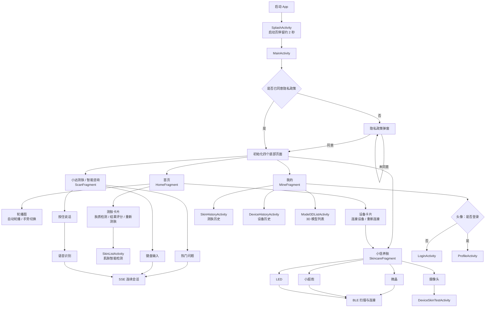
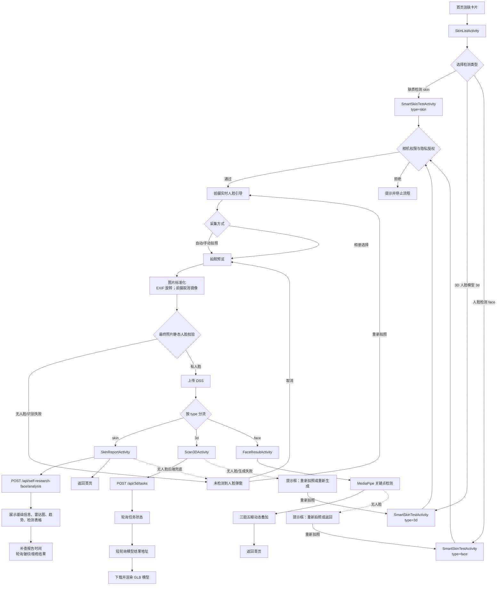
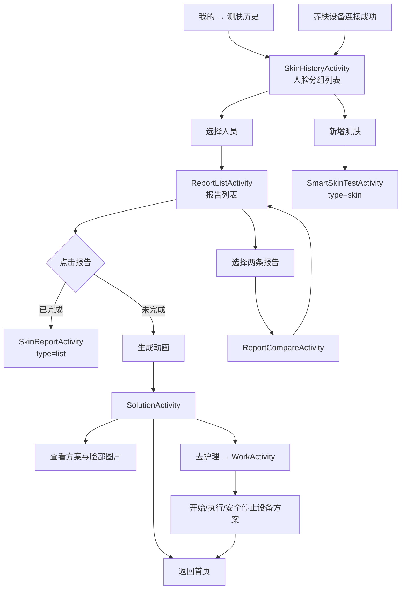
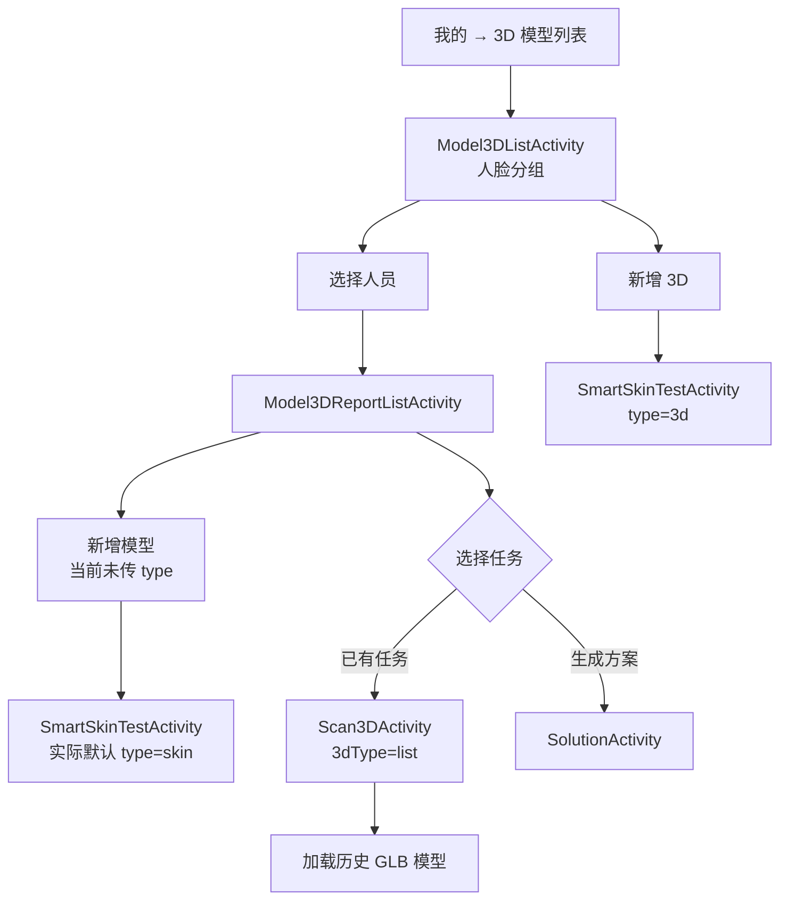
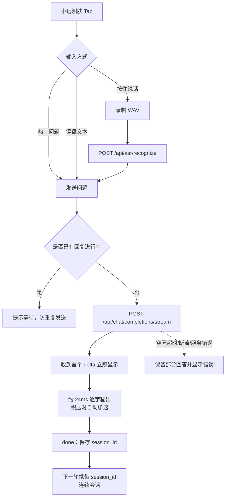
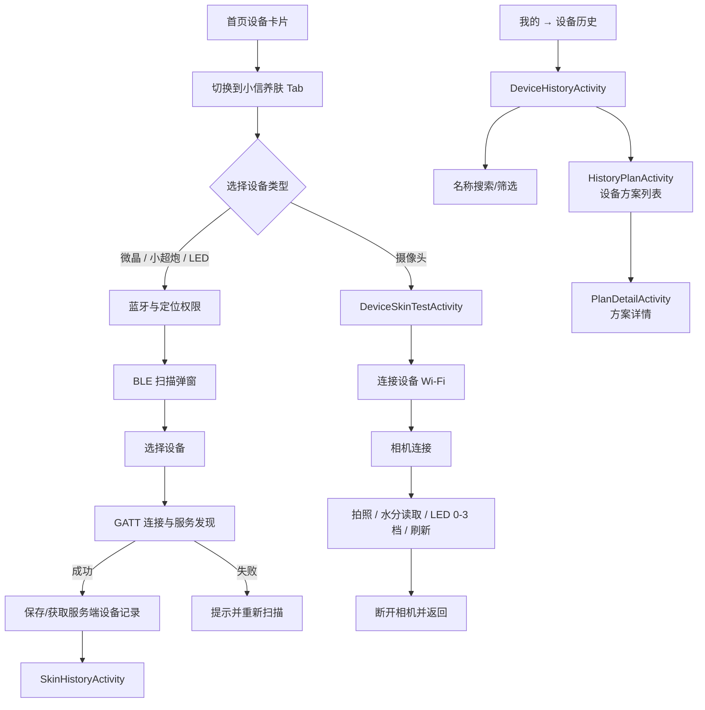
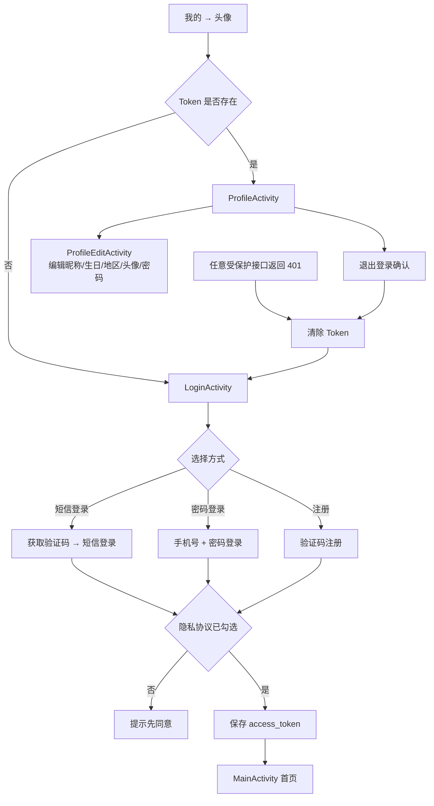

# Aisia Android 应用总体流程图

> 依据当前工作区代码生成，更新时间：2026-08-21。  
> 范围：页面功能、用户交互、Activity/Fragment 跳转、关键接口与异常回退。  
> 说明：实线表示当前可达流程；虚线表示隐藏、旧版或暂无直接入口的页面。

## 1. 应用总体导航

## 2. 肤质检测、3D 模型与人脸检测主流程

### 测肤报告评分与时间规则

- 列表与报告统一优先展示 `skin_score`。
- `skin_score` 缺失时，报告才回退使用 `overall_score`。
- 新分析接口不返回 `created_at` 时，使用 `face_id + report_id` 补查报告详情时间。
- 皱纹、痤疮为独立异步结果；报告页继续获取并刷新对应卡片。

## 3. 测肤历史、报告对比与方案流程

## 4. 3D 模型历史流程

## 5. 智能咨询流程

## 6. 养肤设备与设备历史流程

## 7. 登录、注册与个人资料流程

### 认证请求保护

- 短信发送、短信登录、密码登录均携带唯一 `X-Aisia-Request-Id`。
- 相同认证接口与相同请求内容在进行中时全局去重。
- 登录提交有跨 Activity 实例的短暂冷却。
- 受保护接口返回 401 时，网络层统一清除 Token 并跳转登录页。

## 8. 页面路由表

| 模块 | 页面/组件 | 当前主要功能 | 主要去向 |
|---|---|---|---|
| 启动 | `SplashActivity` | 展示启动页约 2 秒 | `MainActivity` |
| 主框架 | `MainActivity` | 隐私授权、四 Tab Fragment 切换 | 首页 / 智能咨询 / 养肤 / 我的 |
| 首页 | `HomeFragment` | 轮播、测肤卡片、设备卡片、数据状态 | `SkinListActivity` / 养肤 Tab |
| 智能咨询 | `ScanFragment` | 热门问题、文本、语音、SSE 连续会话 | 当前 Fragment 内完成 |
| 养肤 | `SkincareFragment` | BLE 扫描连接、摄像头入口 | `SkinHistoryActivity` / `DeviceSkinTestActivity` |
| 我的 | `MineFragment` | 登录资料、测肤历史、设备历史、3D 历史 | 多个历史/资料页面 |
| 检测菜单 | `SkinListActivity` | 肤质、3D、人脸三类入口 | `SmartSkinTestActivity` |
| 智能采集 | `SmartSkinTestActivity` | 相机/相册、人脸校验、图片标准化、OSS 上传 | 报告 / 3D / 人脸结果 |
| 测肤报告 | `SkinReportActivity` | 雷达、趋势、检测结果、分数、时间、图片 | 首页 / 重新拍照 |
| 3D 结果 | `Scan3DActivity` | 建任务、轮询、下载、渲染 GLB | 返回 / 重拍 / 重试 |
| 人脸结果 | `FaceResultActivity` | 关键点、三庭五眼叠加 | 首页 / 重拍 |
| 测肤人员 | `SkinHistoryActivity` | 人脸分组、新增测肤 | `ReportListActivity` / 采集 |
| 报告列表 | `ReportListActivity` | 查看报告、双报告对比、生成方案 | 报告 / 对比 / 方案 |
| 报告对比 | `ReportCompareActivity` | 两份报告雷达与指标对比 | 返回报告列表 |
| 3D 人员 | `Model3DListActivity` | 3D 人脸分组、新增模型 | 3D 任务列表 / 采集 |
| 3D 任务 | `Model3DReportListActivity` | 历史模型、生成方案 | 3D 渲染 / 方案 |
| 方案 | `SolutionActivity` | 方案详情、图片、去护理 | `WorkActivity` / 首页 |
| 护理执行 | `WorkActivity` | 读取步骤、启动、执行、安全停止设备 | 首页 |
| 摄像头设备 | `DeviceSkinTestActivity` | Wi-Fi 相机、拍照、水分、LED 控制 | 返回养肤 |
| 设备历史 | `DeviceHistoryActivity` | 设备列表、本地搜索 | `HistoryPlanActivity` |
| 历史方案 | `HistoryPlanActivity` | 指定设备的方案列表 | `PlanDetailActivity` |
| 方案详情 | `PlanDetailActivity` | 单个设备方案详情 | 返回 |
| 登录注册 | `LoginActivity` | 验证码、短信登录、密码登录、注册 | 首页 |
| 个人中心 | `ProfileActivity` | 查看资料、退出登录 | 编辑资料 / 登录 |
| 编辑资料 | `ProfileEditActivity` | 保存资料、修改密码 | 个人中心 |
| 项目详情 | `ProjectDetailActivity` | 门店/日期/时段选择、预约 | `OnlineConsultActivity` |
| 在线咨询 | `OnlineConsultActivity` | 客服咨询界面 | 返回 |
| 推荐 | `RecommendActivity` | 查看推荐项目 | 项目详情 |

## 9. 当前隐藏、旧版或未完成入口

| 页面/功能 | 当前状态 |
|---|---|
| 首页轮播图详情 | 点击回调仍为 TODO，当前只支持轮播与指示点 |
| 拍照页“设置”按钮 | 显示“设置功能开发中” |
| 我的 → 护理 | XML 中隐藏，点击逻辑已注释 |
| `SkinTestActivity` | 旧版三角度测肤流程，Manifest 已注册，但当前首页主链不进入 |
| `SkinAnalysisActivity` | 旧版检测菜单，转到 `AiConsultActivity`；当前首页使用 `SkinListActivity` |
| `AiAnalysisActivity` | 旧版分析展示页，当前主采集流程直接进入报告 |
| `AiConsultActivity` | 旧版独立咨询页；当前底部第二 Tab 使用 SSE `ScanFragment` |
| `DeviceConnectionActivity` | 独立 BLE 扫描页已注册，当前养肤主链在 `SkincareFragment` 内完成扫描连接 |
| `Model3DReportListActivity` 的“新增模型” | 当前未传 `type=3d`，实际会进入默认肤质采集流程 |
| `RecommendActivity` / 项目预约链 | 页面存在，但当前主导航没有直接入口 |
| 方案脸部图片全屏预览 | 当前使用外部查看，代码中仍有 PhotoView TODO |

## 10. 关键参数传递

| 来源 → 目标 | 关键参数 |
|---|---|
| `SkinListActivity → SmartSkinTestActivity` | `type=skin/3d/face` |
| `SmartSkinTestActivity → SkinReportActivity` | `oss_key`, `image_path` |
| `SmartSkinTestActivity → Scan3DActivity` | `oss_key`, `image_path`, `3dType=img` |
| `SmartSkinTestActivity → FaceResultActivity` | `oss_key`, `image_path`, `deviceId` |
| `SkinHistoryActivity → ReportListActivity` | `faceId`, `deviceId`, `device_id` |
| `ReportListActivity → SkinReportActivity` | `type=list`, `faceId/id`, `reportId`, `deviceId` |
| `ReportListActivity → ReportCompareActivity` | `reportIdA`, `reportIdB`, `faceId` |
| `Model3DReportListActivity → Scan3DActivity` | `task_id`, `3dType=list` |
| 报告/3D 列表 → `SolutionActivity` | `report_id`, `deviceId`, `device_id` |
| `SolutionActivity → WorkActivity` | `report_id`, `deviceId`, `device_id` |

## 11. 关键接口概览

| 业务 | 接口 |
|---|---|
| 流式智能咨询 | `POST /api/chat/completions/stream` |
| 语音识别 | `POST /api/asr/recognize` |
| 发送验证码 | `POST /api/auth/app/sms/send` |
| 短信登录/注册 | `POST /api/auth/app/sms/login` |
| 密码登录 | `POST /api/auth/app/login` |
| 用户资料 | `GET /api/user/profile` |
| 新建测肤分析 | `POST /api/self-research-face/analysis` |
| 报告详情 | `GET /api/self-research-face/faces/{face_id}/reports/{report_id}` |
| 皱纹/痤疮异步结果 | `GET .../{report_id}/wrinkle`，`GET .../{report_id}/acne` |
| 3D 任务 | `POST /api/3d/tasks` |
| 3D 状态/结果 | `GET .../{task_id}/status`，`GET .../{task_id}/result` |
| 我的设备 | `GET /api/my-device` |
| 护理方案 | `POST /api/my-device/{device_id}/treatment-plans` |

